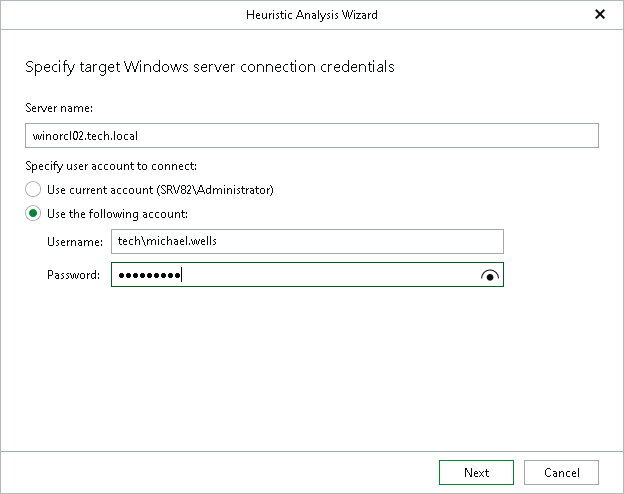

# Step 2. Specify Target Server

At this step of the Heuristic Analysis wizard, specify connection settings required to access the target Oracle server. The set of connection settings depends on the OS type of the target server: Windows or Linux.

Windows-Based Oracle Server

For a Windows-based Oracle server, do the following:

1. In the Server name field, specify the DNS name or IP address of the server to which you want to restore data.
2. In the Specify user account to connect to server section, select one of the following:

* Use current account. To connect to the specified server using the current user account under which Veeam Explorer for Oracle is running.
* Use the following account. To connect to the specified server under a custom user account.

For more information on the required user account settings, see the [Permissions](veo_permissions.md) section.

Linux-Based Oracle Server

For a Linux-based Oracle server, do the following:

1. In the Server field, specify the DNS name or IP address of the target Oracle server.
2. In the SSH port field, specify the port number of the selected Oracle server.
3. In the Account field, specify an account under which to connect to the specified server. For more information on the required user account configuration, see the [Permissions](veo_permissions.md) section.
4. In the Password field, enter the password.
5. If you have specified a non-root account that does not have root permissions on the target server, click Advanced to grant sudo rights to this account.

1. To provide a non-root user with root account privileges, select the Elevate specified account to root check box.
2. To add the user account to the sudoers file, select the Add account to the sudoers file automatically check box. In the Root password field, enter the password for the root account.

If you do not enable this option, you will have to manually add the user account to the sudoers file.

1. If the sudo command is not available or may fail on the target Linux server, you have an option to use the su command instead. To enable the su command, select the Use su if sudo is unavailable check box and enter the password for the root account in the Root password field.

1. If a private key is required to connect to the selected server, do the following:

1. Select the Private key is required for this connection check box.
2. In the Private key field, specify a key.

To select a key, click Browse and select a key.

1. In the Passphrase field, enter the passphrase.

