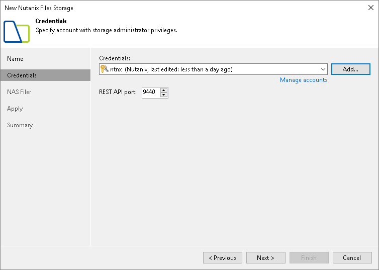

# Step 3. Specify Credentials

At the Credentials step of the wizard, specify credentials of a Nutanix user account with administrator privileges and [REST API access](https://portal.nutanix.com/page/documents/details?targetId=Files-v5_0:fil-file-server-rest-api-access-t.html) to the storage system. Also, specify a port through which the user will access the storage system.

If you have not set up credentials beforehand, click the Manage accounts link or click Add on the right of the Credentials field to add the credentials. For more information, see the [Credentials Manager](credentials_manager.md) section in the Veeam Backup & Replication User Guide.

After you click Next, Veeam Backup & Replication checks the TLS certificate installed on the storage system. If the certificate is not trusted, Veeam Backup & Replication displays a warning. In the warning window, you can do the following:

* Click View for the detailed information about the certificate.
* Click Continue to trust the certificate.
* Click Cancel if you do not trust the certificate. However, in this case you will not be able to connect to the storage system.

Veeam Backup & Replication saves to the configuration database a thumbprint of the TLS certificate. During every subsequent connection to the storage system, Veeam Backup & Replication uses the saved thumbprint to verify the storage system identity and avoid the man-in-the-middle attack. For details on managing TLS Certificates, see the [Backup Server Certificate](backup_server_certificate.md) section in the Veeam Backup & Replication User Guide

When you update a certificate on the storage system, this storage system becomes unavailable in the Veeam Backup & Replication console. To make the storage system available again, acknowledge the new certificate at the Credentials step of the edit storage system wizard.

