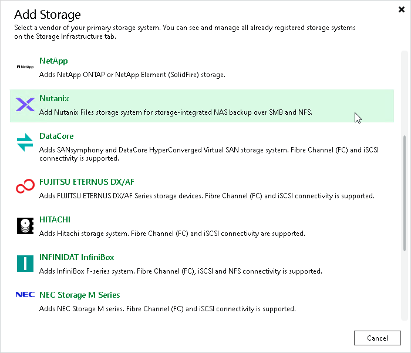

# Step 1. Launch New Nutanix Files Storage Wizard

To launch the New Nutanix Files Storage wizard, do one of the following:

* Open the Storage Infrastructure view. In the working area, click Add Storage. In the displayed window, click Nutanix.
* Open the Storage Infrastructure view. In the inventory pane, right-click the Storage Infrastructure node and select Add Storage. In the displayed window, click Nutanix.
* You can use this method if at least one Nutanix Files storage system is added to the backup infrastructure.

Open the Storage Infrastructure view. In the inventory pane, right-click the Nutanix node and select Add storage. You can also select the Nutanix node in the inventory pane, right-click anywhere in the working area and select Add storage.

