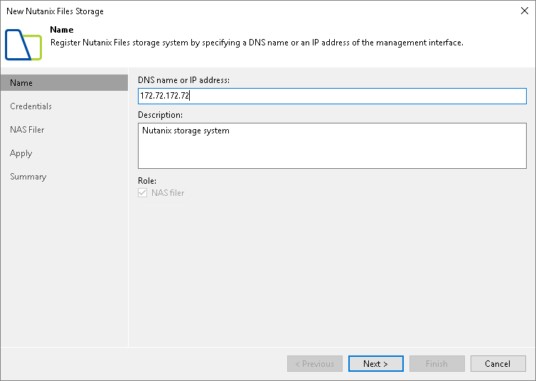

# Step 2. Specify Storage Name or Address and Storage Role

At the Name step of the wizard, specify the storage system name and description:

1. In the DNS name or IP address field, specify a DNS name or client-side IPv4 address of a file server VM (FSVM).
2. In the Description field, provide a description for future reference.

Only NAS backup jobs are allowed to access this storage system, so the NAS filer check box is selected automatically in the Role section.

