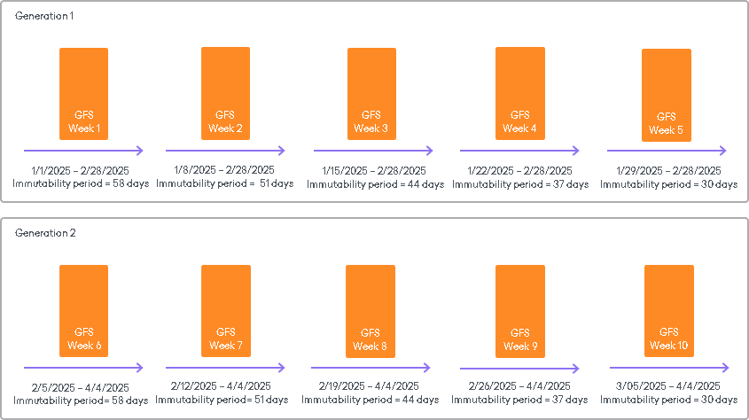
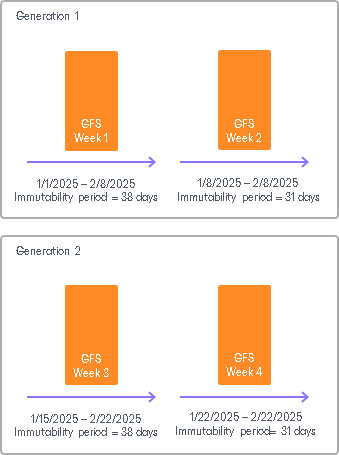

# Block Generation

Block Generation is a time period within which all blocks in backup files (both full and increment backup files) have the same immutability period. Block Generation reduces the number of requests to the object storage repository, thereby saving traffic and reducing costs that can be incurred by your object storage provider. You do not have to configure it, the Block Generation setting is applied automatically.

Depending on the type of the object storage repository, Veeam Backup & Replication will add the following values for the default Block Generation period:

* 30 days — for Amazon S3 object storage, IBM Cloud object storage, Google Cloud object storage and for 11:11 Cloud object storage.
* 10 days — for all other types of object storage repositories.

For example, if you set your immutability period to 30 days for your object storage repository, Veeam Backup & Replication will add 10 days to specific objects to reduce I/O operations with the data blocks over time. Thus, you will have immutability set for 30 days + 10 days of Block Generation set for data blocks in your object storage repositories.

How Block Generation Works

When the first data block (a full backup) arrives, its immutability period by default is set to 30 + 10 = 40 days. The first full backup starts its generation, that will be appended with the incremental backups. All the incremental backups within the generation (that is, within the 10-days period) will have the same immutability expiration date as the full backup. For instance, a data block that was offloaded on day 9 will have the same immutability expiration date as a data block offloaded on day 1. Thus we ensure that the immutability period for all the data blocks within a generation is no less than 30 days.

To maintain the backup consistency, Veeam Backup & Replication can extend immutability expiration for all data blocks in all backup chains (both active and inactive) and assign these blocks to a new generation. For example, within one forward incremental backup chain, a full backup file cannot be removed before an incremental backup file. On the other hand, an incremental backup file makes no sense without relevant full backup file. So the immutability period is extended for all data blocks in the backup chain.

|  |
| --- |
| Note |
| Consider the following:   * The immutability period differs from the actual retention of the object storage repository. For more information, see [Object Storage Actual Retention](hiw_immutability_os.md#retention). * For data blocks located in object storage repositories, Veeam Backup & Replication extends the immutability period for every data block of every backup file in the whole backup chain, even in an inactive part. * Veeam Backup & Replication will not extend immutability for the data blocks that are not used in any existing backup files. |

Block Generation for GFS Backups

For GFS backups, Veeam Backup & Replication checks the GFS retention period and sets the Block Generation period if it is longer than the minimum GFS retention period.  In this case, the immutability period for GFS backups is not less than the GFS retention period and does not exceed the GFS retention period + the Block Generation period.

Considering that the default Block Generation period is either 10 or 30 days, the Block Generation is assigned for weekly GFS backups by default. This behavior is particularly significant for weekly GFS backups, as there is a high probability that full backup files will share a large number of blocks since only one week passes between the first and the second weekly GFS backups. If Veeam Backup & Replication does not assign Block Generation for weekly GFS backups, it will need to extend immutability for the shared blocks each week, resulting in additional I/O operations and costs.

The actual retention of the immutable weekly GFS backups depends on the Block Generation period (10 or 30 days). Consider the following examples for weekly GFS backups with different Block Generation periods.

Example 1. Weekly GFS Backups and Block Generation is 30 Days

The retention period of a weekly GFS backup is 28 days, and the Block Generation period is 30 days, so the actual retention is 58 days. The first weekly GFS backup is created on 1/1/2025 and starts Generation 1, which will be protected until 2/28/2025 and will take 5 weeks to expire. The Block Generation period is reduced every week by 7 days. Generation 2 starts on 2/5/2025 with the 6th weekly GFS backup and will be protected until 4/4/2025.

Example 2. Weekly GFS Backup and Block Generation is 10 Days

The retention period of a weekly GFS backup is 28 days, and the Block Generation period is 10 days, so the actual retention is 38 days. The first weekly GFS backup is created on 1/1/2025 and starts Generation 1, which will be protected until 2/8/2025 and will take 2 weeks to expire. Block generation period is reduced every week by 7 days. Generations 2 starts on 1/15/2025 with the 3rd weekly GFS backup and will be protected until 2/22/2025.

