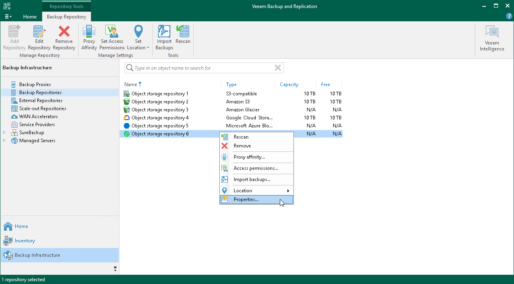

# Editing Settings of Object Storage Repository

After you have added an object storage repository, you may want to edit its settings.

To edit object storage settings, do the following:

1. Open the Backup Infrastructure view.
2. In the [inventory pane](vbr_ui.md), select Backup Repositories.
3. In the working area, select an object storage repository and click Edit Repository on the ribbon or right-click an object storage repository and select Properties.
4. Follow the steps of the Edit Object Storage Repository wizard and edit settings as required.

Note that some settings cannot be modified and will remain disabled while being edited.

