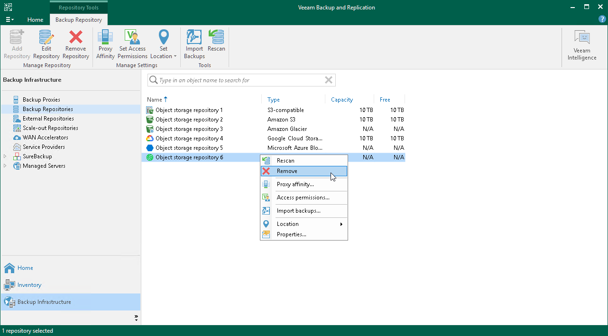

# Removing Object Storage Repository

In this article

You can remove any object storage repository from the application scope if you no longer need it.

Considerations and Limitations

Before you remove an object storage repository, consider the following limitations:

* An object storage repository cannot be removed if it is part of a scale-out backup repository.

To remove such a repository, you must first exclude an object storage repository from the scale-out backup repository configuration. For more information, see [Removing Performance Extents from Scale-Out Repositories](sobr_remove_extent.md) and [Excluding Capacity Extent from Scale-Out Repositories](excluding_object_storage.md).

* An object storage repository cannot be removed if backups located in this repository was imported, as described in section [Importing Object Storage Backups](osr_import_backups.md).

To remove such a repository, you must first detach object storage, as described in section [Detaching Object Storage Backups](osr_detach_backups.md).

* When an object storage repository is being removed from the environment, the data remains completely unaffected.

To learn how to remove data, see [Removing Backups from Capacity or Archive Tier](object_storage_removing_data.md).

Removing Object Storage Repository

To remove an object storage repository, do the following:

1. Open the Backup Infrastructure view.
2. In the inventory pane, select Backup Repositories.
3. In the working area, select an object storage repository and click Remove Repository on the ribbon or right-click an object storage repository and select Remove.

Page updated 8/8/2024

Page content applies to build 13.0.1.1071
