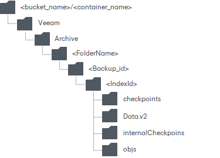

# Capacity Extent Structure

When data is transferred to the capacity extent, Veeam Backup & Replication creates and maintains the following structure of directories:

| Directory | Description | Misc |
| --- | --- | --- |
| <bucket\_name> or <container\_name> | A bucket or container name.  Buckets and containers must be created in advance. | N/A |
| Veeam/Archive/ | Standard folders created by Veeam Backup & Replication. |
| <FolderName> | A repository folder that you create when adding a new capacity extent. |
| <Backup\_id> | Contains objects in a backup. | These folders are automatically removed during data removal. |
| <Index\_Id> | An identifier of an object in a backup.   * If a backup was created using the [per-machine](per_vm_backup_files.md) method, then each VM will be placed to its own directory. * If a backup was created as a single-file backup, then all the VMs will be placed to a unique directory. |
| Checkpoints | Contains meta information about the state of offloaded backup chains. Such meta information is updated upon each successful offload session. |
| Data.v2 | Contains data blocks and metadata related to these blocks. |
| internalCheckpoints | Auxilliary checkpoints. Contain information on backup files and metadata. |
| objs | Contains meta information and other auxiliary data. |

Related Topics

* [Data Transfer](capacity_tier_data_transfer.md)
* [Removing Backups from Capacity or Archive Tier](object_storage_removing_data.md)

