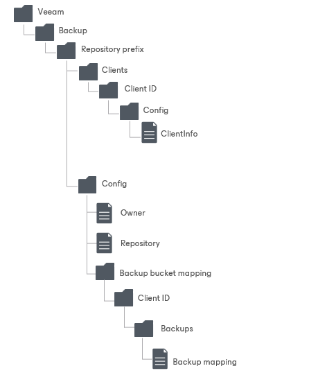

# Object Storage Repository Structure

After backups are moved to an object storage repository, Veeam Backup & Replication creates and maintains the following structure of directories.

| Directory | Description |
| --- | --- |
| Veeam/Backup/ | Standard folders created by Veeam Backup & Replication. |
| Repository\_folder\_name | Contains information on the repository name and the repository ID. |
| Clients | Contains backups. |
| Client catalogue | Contains information on solutions that create backups to this repository. |
| Backup catalogue | Contains backup ID. |
| CloudStg | Contains data blocks. |
| MetaData | Contains metadata. |
| Config | Contains information on the object storage repository infrastructure. |
| Owner | Contains information on a repository owner. |
| Repository | Contains information on a repository. |

Repository Structure for Multiple Buckets for S3 Compatible Object Storage Repositories

Veeam Backup & Replication creates and maintains the following structure of directories for S3 Compatible object storage repositories with multiple buckets.

| Directory | Description |
| --- | --- |
| Veeam/Backup/ | Standard folders created by Veeam Backup & Replication for object storage repositories. |
| Repository\_prefix | Contains information on the repository name and the repository ID. |
| Clients | Contains information on solutions that create backups to this repository. |
| Client ID | Contains information on ID of solutions that create backups to this repository. |
| Config | Contains information on the object storage repository infrastructure. |
| ClientInfo | Contains information on the object storage immutability settings, tags and metadata. |
| Config | Contains information on the object storage repository infrastructure. |
| Owner | Contains information on a repository owner. |
| Repository | Contains information on a repository. |
| Backup bucket mapping | Contains information on backup mapping metadata. |
| Client ID | Contains information on solutions that create backups to this repository. |
| Backups | Contains backups. |
| Backup mapping | XML with mapping metadata. |

