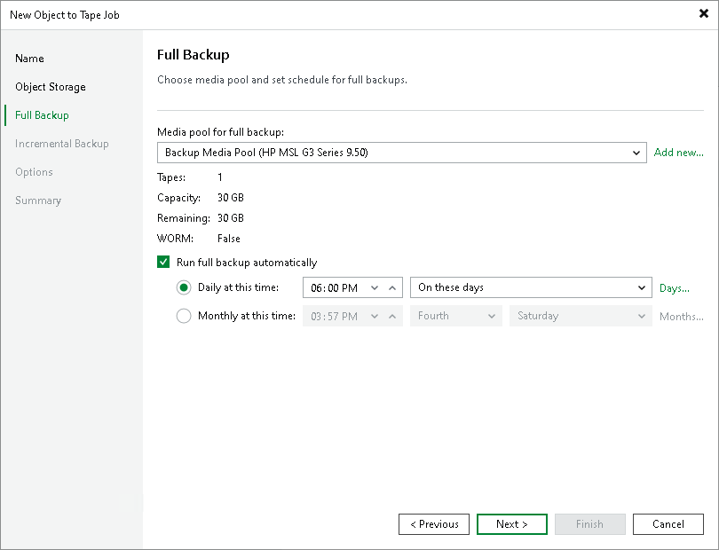

# Step 4. Choose Media Pool for Full Backup

At the Full Backup step of the wizard, choose a media pool that will be used for archiving full backups of the selected objects and set a schedule for full backups.

1. From the Media pool for full backup list, choose a media pool that will be used for full backups.

You can select a regular media pool or a GFS media pool. Depending on the selected type, the job schedule will change to a regular schedule or GFS schedule.

|  |
| --- |
| Tip |
| If you have not previously created a media pool with the required settings, you can click the Add New button and create a new media pool without closing the job wizard. For more details, see [Creating Media Pools](creating_custom_media_pools.md) or [Creating GFS Media Pools](creating_gfs_media_pools.md). |

1. [For regular media pools] To schedule periodic creation of full backups, select the Run full backup automatically check box and specify the schedule according to which the job will create full backups. If this option is disabled, you will need to start the job manually to create full backups of object storage.

