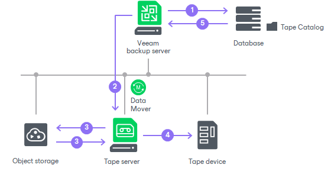
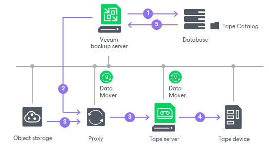

# How Object Storage Backup to Tape Works

When Veeam Backup & Replication executes an object to tape job (started manually or by schedule), it performs the following operations:

1. The object to tape job detects objects that match the job criteria.
2. The objects are queued for archiving:

* If it is a first job run or a scheduled full backup, all selected objects are queued for archiving.
* If it is an incremental backup run, Veeam Backup & Replication addresses the Tape Catalog in the Veeam Backup & Replication database to detect if any data has been modified since the latest backup. The detected changes are queued for archiving.

1. Veeam Backup & Replication connects to Veeam Data Movers and starts the data transfer process. The tape server acts as a gateway server for the object storage and hosts Veeam Data Movers.
2. The tape job addresses the media pool that is set for this job as the target. The media pool allots tapes for writing data according to the following configuration options:

* Tapes consumption
* Media sets
* Tape retention

1. While tape recording is performed, Veeam Backup service updates data in the Tape Catalog in the configuration database. The Veeam Backup & Replication console displays refreshed information about objects archived to tape and shows job statistics.

|  |
| --- |
| Note |
| Object to tape jobs do not calculate and display the job progress bar to avoid extra object storage costs. You can see the total count of the objects processed and the job result in the Status column of the Statistics window. |

If you [explicitly specify proxy servers](tape_add_amazon_s3_processing.md) for the object storage, Veeam Backup & Replication performs object backup to tape in the following way:

