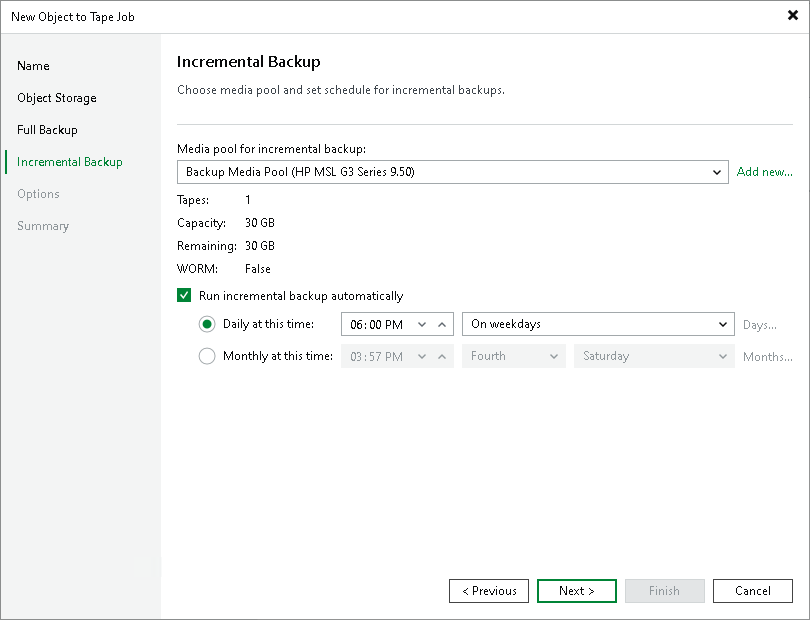

# Step 5. Specify Media Pool for Incremental Backups

This step is available only if you selected a regular media pool as target for full backups.

At the Incremental Backup step of the wizard, choose a media pool that will be used for archiving incremental backups of the selected objects and set a schedule for incremental backups. Veeam Backup & Replication allows you to select different media pools for full backups and incremental backups. This can be required if you use different media set or retention settings for archiving full backups and increments.

1. From the Media pool for incremental backup list, choose a media pool that will be used for incremental object backups.

|  |
| --- |
| Tip |
| If you have not previously created a media pool with the required settings, you can click the Add New button and create a new media pool without closing the job wizard. For more details, see [Creating Media Pools](creating_custom_media_pools.md). |

1. To schedule periodic creation of incremental file backups, select the Run incremental backup automatically check box and specify the schedule according to which the job will create incremental backups. If this option is disabled, you will need to start the job manually to create incremental backups of object storage.

|  |
| --- |
| Note |
| You cannot select a GFS media pool to archive incremental backups to tape. Instead you can configure a daily media set in the GFS media pool to archive incremental points along with GFS points, combining normal and GFS functionality within a single job. For more details, see [Creating GFS Media Pools](creating_gfs_media_pools.md). |

