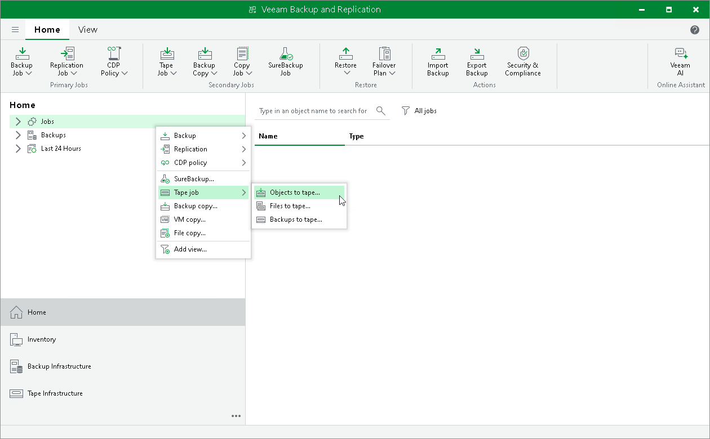

# Step 1. Launch New Object to Tape Job Wizard

In this article

To run the New Object to Tape Job wizard, do either of the following:

* On the Home tab, click Tape Job and select Objects.
* Open the Home view, right-click the Jobs node and select Tape Job > Objects to Tape.

* Open the Files view, browse to the necessary object storage buckets, select the bucket or object and choose Add to Tape Job > New job from the ribbon menu.
* Open the Files view, browse to the required object storage buckets, right-click the necessary bucket or object and choose Add to Tape Job > New job.

Page updated 12/5/2023

Page content applies to build 13.0.1.1071
