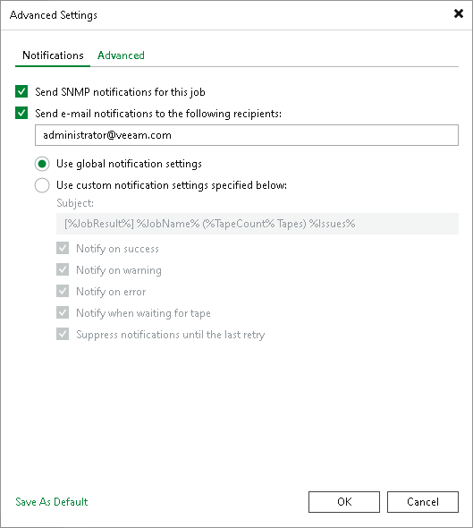

# Notifications Settings

In this article

To specify notification settings for the backup job:

1. At the Options step of the wizard, click Advanced.
2. Click the Notifications tab.
3. Select the Send SNMP notifications for this job check box if you want to receive SNMP notifications. For more information, see [Specifying SNMP Settings](snmp_settings.md).
4. Select the Send email notifications to the following recipients check box if you want to receive notifications about tape job status. In the field below, specify a recipient’s email address. You can enter several addresses separated by a semicolon.

|  |
| --- |
| Important |
| To receive notifications about tape jobs, you must enable general email notifications in Veeam Backup & Replication. For more information, see [Specifying Email Notification Settings](email_notification_settings.md). |

You can choose between the following options:

* Use global notification settings: Veeam Backup & Replication will notify you according to global email notification settings specified for the Veeam backup server.
* Use custom notification settings specified below: you can specify notification settings for tape jobs.

In the Subject field, specify a notification subject. You can use the following variables in the subject:

* %Time%: the time when the tape job finished.
* %JobName%: the name of the tape job.
* %TapeCount%: the number of tapes used for the tape job session.
* %JobResult%: the job result.
* %VmCount%: the number of machines in the job.
* %Issues%: the number of machines in the job processed with Warning or Failed status.

Select the occasions on which you want to receive email notifications:

* Notify on success: Veeam Backup & Replication will notify you if the tape job finishes successfully.
* Notify on warning: Veeam Backup & Replication will notify you if the tape job finishes with a warning.
* Notify on error: Veeam Backup & Replication will notify you if the tape job fails.
* Notify when waiting for tape: Veeam Backup & Replication will notify you if the tape job cannot start because there are no available tapes.
* Suppress notifications until the last retry: Veeam Backup & Replication will notify you on the selected events only after the last job retry.

Page updated 1/15/2026

Page content applies to build 13.0.1.1071
