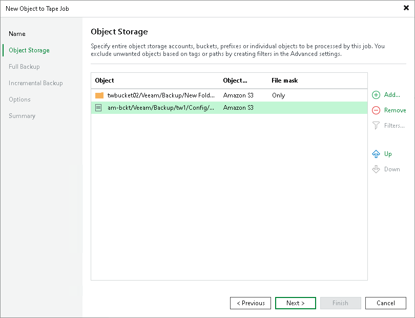
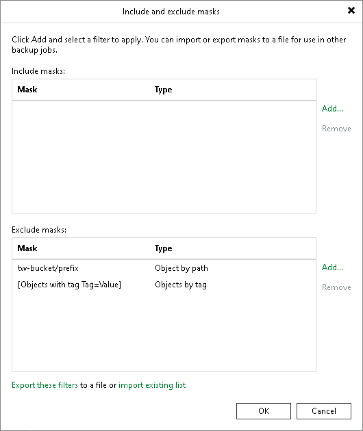

# Step 3. Choose Objects to Archive

At the Object Storage step of the wizard, select accounts, buckets, prefixes and individual objects that you want to back up to tape. If you add an object storage account, bucket or prefix to the job, all its contents will be processed. If necessary, you can define inclusion and exclusion settings to choose or exclude specific buckets, prefixes or objects from the job.

Adding Entire Buckets, Prefixes and Objects

To select object storage data to be backed up to tape:

1. Click Add.
2. From the Object Storage drop-down list, select a data source where the necessary objects reside.
3. In the Objects tree, select objects you want to backup:

* If you select an entire object storage account, all buckets and their contents are added to the tape job. Any new items added to the object storage account after the creation of the job will be backed up with the next job run.
* If you select a specific bucket, container or prefix, only its contents are added to the tape job. If there is a new item added to the bucket, container or prefix after the creation of the job, it will be backed up with the next job run.
* You can select specific objects to be archived to tape.
* You can select a combination of buckets, prefixes and objects to be added to the tape job.

|  |
| --- |
| Tip |
| To select multiple objects, hold [Ctrl] and click necessary buckets, prefixes and objects. |

The account you use to access the object storage must have all [required permissions](object_to_tape_before_you_begin.md#permissions) for the object storage access.

1. In the Object Storage screen, use the Up and Down buttons on the right to move sources up or down. The sources of the job are processed in the order in which the list displays them.

Including and Excluding Buckets, Prefixes and Objects

To specify filters:

1. Select an account, bucket, container or prefix in the list and click Filters.
2. To specify inclusion rules, click Add next to the Include masks field:

* Use the Object by tag option to include only prefixes and objects with a specific tag. Specify the tag name and value in the Include object by tag window and click OK.
* Use the Bucket by tag option to include only buckets and containers with specific metadata. Specify the metadata name and value in the Include bucket by tag window and click OK.

1. To specify exclusion rules, click Add next to the Exclude masks field:

* Use the Object by path option to exclude buckets, prefixes and objects based on location. For example, bucket/myprefix excludes all objects with the name starting from myprefix.
* Use the Object from all buckets option to exclude objects from all protected buckets based on name. For example, myprefix/object excludes the object from all myprefix locations for the selected object storage protection.
* Use the Object by tag option to exclude prefixes and object with a specific tag. Specify the tag name and value in the Exclude object by tag window and click OK.
* Use the Bucket by tag option to exclude buckets and containers with specific metadata. Specify the metadata name and value in the Exclude bucket by tag window and click OK.

|  |
| --- |
| Note |
| Consider the following:   * The Veeam directory is automatically added to the list of excluded prefixes. It excludes all backup files created by other backup jobs targeted at this object storage.  * The Exclude masks field has priority over the Include masks field. If you add a bucket to the Include masks field, and an object within this bucket is listed in the Exclude masks field, the object will be excluded from the job. |

If you want to reuse the inclusion and exclusion settings in the future, you can save them to an XML file. Click Export these filters at the bottom of the Include and exclude masks window and specify the location for the file. When it is necessary to use the same inclusion and exclusion settings again for a new job, click Import existing list and browse to the file location. Veeam Backup & Replication will import the masks and display them in the Include and exclude masks window.

