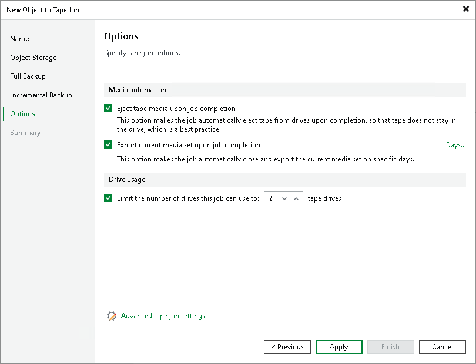

# Options for Object to Tape Job

This step of the wizard is available if you selected a regular media pool at the Full Backup step of the wizard.

At the Options step of the wizard, specify archiving and media automation options:

* To automatically eject the tape from the tape drive and place it into a slot when the job finishes, select the Eject tape media upon job completion check box.

* To pull out the tapes with the current media set from the tape device, select the Export current media set upon job completion check box. You can use this option, for example, to move tapes to another storage location. The tape device will eject the tapes that belong to the current media set when the media set is closed.

To export tapes on specific days only (for example, every Saturday), click Days and schedule export on the necessary days.

Note that with this option selected, a new media set is started after each export.

* To limit the number of drives to use for processing the tape job, select the Limit the number of drives this job can use to N tape drives check box and specify the number of drives to use. For more information, see [Add Optional Media Pool Settings](add_media_pool_encryption.md).

