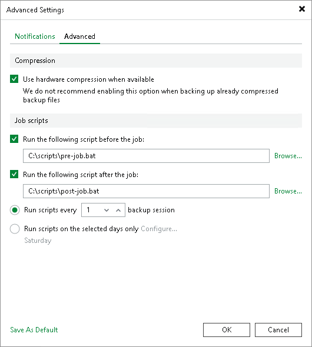

# Advanced Settings

In this article

To enable hardware compression or specify custom scripts that you want to run before and after the object to tape job:

1. At the Options step of the wizard, click Advanced.
2. Select the Use hardware compression when available check box if the tape drive should compress data before writing it to tape.

Most manufacturers add the hardware compression feature to their tape drives. This allows performing data compression by a drive. Usually the declared compression ratio for magnetic tape drives is 2:1 or 2.5:1. In practice, this ratio depends on the type of the raw data. Veeam Backup & Replication cannot display the compressed tape capacity. You can learn the size of the compressed data written to tapes only by checking how much free space is left on the tape after the tape job is finished.

1. Select the Run the following script before the job and Run the following script after the job check boxes and click Browse to choose executable files. You can select to execute pre- and post-job actions after a number of job sessions or on specific week days.

* If you select the Run scripts every N backup session option, specify the number of the job sessions after which the scripts must be executed.
* If you select the Run scripts on the selected days only option, click Days and specify week days on which the scripts must be executed.

Page updated 7/11/2024

Page content applies to build 13.0.1.1071
