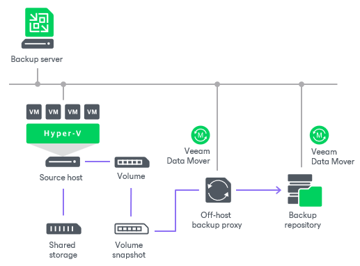

# Off-Host Backup

In the off-host backup mode, backup processing is shifted from the source Microsoft Hyper-V host to a dedicated machine — an off-host backup proxy.

The off-host backup proxy acts as a “data mover”. Veeam Data Mover running on the off-host backup proxy retrieves VM data from the source volume, processes it and transfers data to the destination. This type of backup does not impose a load on the source host. As resource-intensive data processing operations are performed on the off-host backup proxy, production hosts remain unaffected.

To perform off-host backup, Veeam Backup & Replication uses transportable shadow copies. The transportable shadow copy technology lets the backup application create a snapshot of a data volume on which VM disks are located, and import, or mount, this snapshot onto another server in the same subsystem (SAN) for backup and other purposes. The transport process is accomplished in a few minutes, regardless of the amount of the data. The process is performed at the SAN storage layer, so it does not impact host CPU usage or network performance. For more information about transportable shadow copies, see [Microsoft Docs](http://technet.microsoft.com/en-us/library/ee923636%28v%3Dws.10%29.aspx).

To perform off-host backup, the backup infrastructure must meet the following requirements:

* You must configure an off-host backup proxy. For more information, see [Off-Host Backup Proxies](offhost_backup_proxy.md).
* In the properties of a backup or replication job, you must select the off-host backup method and off-host backup proxy that you want to use. If necessary, you can point the job to a specific off-host backup proxy. For more information, see [Configuring Advanced Options for Off-Host Backup Proxies](offhost_proxy_advanced.md).

The off-host backup process is performed in the following way:

1. Veeam Backup & Replication triggers a snapshot of the necessary volume on the Microsoft Hyper-V host.
2. The created snapshot is detached from the host and mounted to the off-host backup proxy.
3. Veeam Data Mover, running on the off-host backup proxy, uses the mounted volume snapshot as a data source. It retrieves VM data from the volume snapshot, processes it and transports it to the destination.
4. After the backup process is complete, the snapshot is dismounted from the off-host backup proxy and deleted on the storage system.

|  |
| --- |
| Important |
| If you plan to perform an off-host backup for a Microsoft Hyper-V cluster with CSV, make sure you deploy an off-host backup proxy on a host that is NOT part of a Hyper-V cluster. |

Helpful Resources

* [List of tested VSS hardware providers for DPM](https://technet.microsoft.com/en-us/library/hh758219%28v%3Dsc.12%29.aspx)
* Links to resources and documentation from some of storage vendors:

+ [HPE Support Center](https://support.hpe.com/hpesc/public/home)
+ [DELL PowerVault](http://www.dell.com/downloads/global/products/pvaul/en/hyperv_data_protection_guide_on_%20dell_powervault_md_series.pdf)

The VSS hardware provider for Dell PowerVault can be found on the Resource CD.

* [DELL Equal Logic](https://www.dell.com/support/contents/en-us/article/product-support/self-support-knowledgebase/enterprise-resource-center/dell-technologies-subsidiaries/equallogic?msockid=0dc91cc0321760762b61085a33be618e)

The VSS hardware provider is a part of Host Integration Tool (HIT/Microsoft).

To get detailed information, contact your storage vendor.

Related Topics

* [Off-Host Backup Proxy](offhost_backup_proxy.md)
* [Creating Backup Jobs](backup_job_hv.md)

* [Creating Replication Jobs](replica_job_hv.md)

