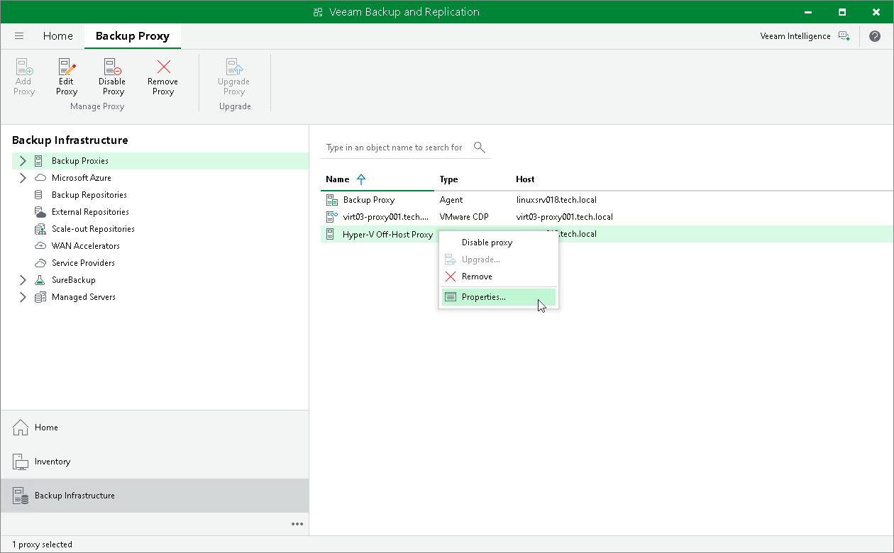

# Editing Backup Proxy Settings

You can edit settings of off-host backup proxies you have configured.

To edit off-host backup proxy settings:

1. Open the Backup Infrastructure view.
2. In the inventory pane, select the Backup Proxies node.
3. In the working area, select the off-host backup proxy and click Edit Proxy on the ribbon or right-click the off-host backup proxy and select Properties.
4. Edit off-host backup proxy settings as required.

