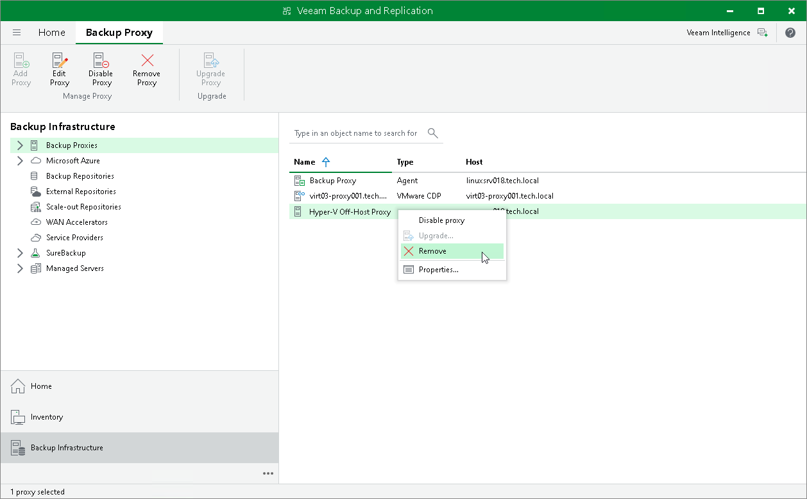

# Disabling and Removing Backup Proxies

You can temporarily disable an off-host backup proxy or remove it from the backup infrastructure.

Disabling Backup Proxies

When you disable an off-host backup proxy, Veeam Backup & Replication does not use this off-host backup proxy for any jobs configured on the backup server. Off-host backup proxy disabling can be helpful if you instruct Veeam Backup & Replication to automatically select off-host backup proxies for jobs and do not want Veeam Backup & Replication to use specific off-host backup proxies.

To disable an off-host backup proxy:

1. Open the Backup Infrastructure view.
2. In the [inventory pane](vbr_ui.md), select the Backup Proxies node.
3. In the working area, select the off-host backup proxy and click Disable Proxy on the ribbon or right-click the off-host backup proxy and select Disable proxy.

You can enable a disabled off-host backup proxy at any time:

1. Open the Backup Infrastructure view.
2. In the inventory pane, select the Backup Proxies node.
3. In the working area, select the off-host backup proxy and click Disable Proxy on the ribbon once again or right-click the off-host backup proxy and select Disable proxy.

Removing Backup Proxies

You can permanently remove an off-host backup proxy from the backup infrastructure. When you remove an off-host backup proxy, Veeam Backup & Replication unassigns the off-host backup proxy role from the server, and this server is no longer used as an off-host backup proxy. The actual server remains in the backup infrastructure.

You cannot remove an off-host backup proxy that is explicitly selected in any backup or replication job. To remove such off-host backup proxy, you first need to delete a reference to this off-host backup proxy in the job settings.

To remove a backup proxy:

1. Open the Backup Infrastructure view.
2. In the inventory pane, select the Backup Proxies node.
3. In the working area, select the off-host backup proxy and click Remove Proxy on the ribbon or right-click the off-host backup proxy and select Remove.

