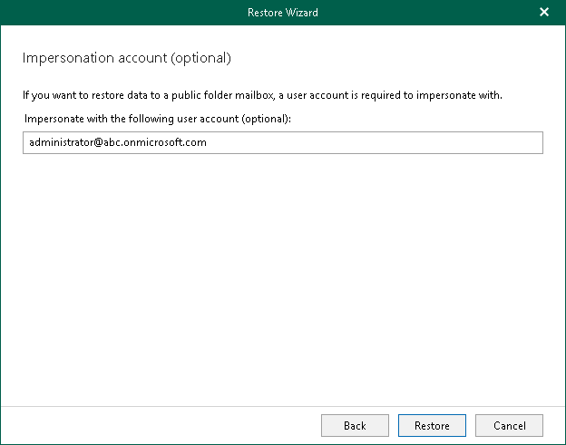

# Step 4. Specify Impersonation Account

This step is only available if you have selected the Modern Authentication (certificate-based) option at the [Select Authentication Method](select_authentication_method_mfa_one_click.md#certificate) step. Note that this step is only available for Veeam Explorer for Microsoft Exchange that comes with the Veeam Backup for Microsoft 365 installation.

If you want to restore your data to a public folder mailbox, you can optionally specify a user account to impersonate with this public folder mailbox.

