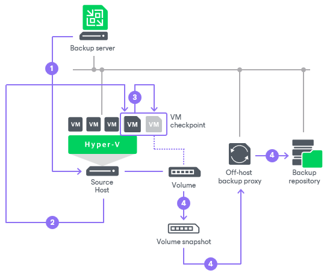

# Online Backup

Online backup is the recommended backup method for Microsoft Hyper-V VMs as it requires no downtime. VMs remain running during the entire backup period, and users can access them without interruption. Online backup can be performed if Microsoft Hyper-V VMs meet several requirements. For more information, see [Microsoft Hyper-V documentation](http://technet.microsoft.com/en-us/library/dd252619%28WS.10%29.aspx).

Online backup of VMs on Microsoft Hyper-V 2016 and later relies on production checkpoints. Production checkpoints are point-in-time images of VMs. When creating production checkpoints, Microsoft Hyper-V does not put VMs into the saved state. Instead, it quiesces data on VMs using Microsoft VSS technology (for Microsoft Windows VMs) or file system freeze (for Linux VMs). The resulting checkpoints are application-consistent and allow recovery of VMs without any data loss.

Veeam Backup & Replication performs online backup using production checkpoints only if the following conditions are met:

* VM configuration version is upgraded to 8.x.
* VMs are deployed on Microsoft Hyper-V Server 2016 or later.
* [For Microsoft Hyper-V clusters] All hosts in the cluster are upgraded to Microsoft Hyper-V Server 2016 or later, and the cluster functional level is upgraded.

Online backup is performed in the following way:

1. Veeam Backup & Replication requests a production checkpoint of a specific VM.
2. Microsoft Hyper-V Virtual Machine Management Service (for Microsoft Windows VMs) or file system freeze (for Linux VMs) brings data on the VM guest OS to a consistent state.
3. Microsoft Hyper-V Virtual Machine Management Service creates a production checkpoint for the VM. Every virtual disk of a VM receives a temporary AVHDX file. All new writes are redirected to temporary AVHDX files.
4. Further activities depend on the backup mode:

+ In the on-host backup mode, Veeam Backup & Replication takes a VM checkpoint and reads data from the base disk. After the VM processing is complete, the production checkpoint is merged with the original VM.
+ In the off-host backup mode, the Microsoft Hyper-V host VSS provider takes a snapshot of the volume where VM disks are located. The volume snapshot is mounted to the off-host backup proxy and presented to Veeam Backup & Replication. Veeam Backup & Replication reads VM data from the base disk on the volume snapshot. After VM processing is complete, the production checkpoint is merged with the original VM. When all VMs in the group for which the volume snapshot is created are processed, Veeam Backup & Replication triggers volume snapshot deletion.

Related Topics

* [Crash-Consistent Backup](crash_consistent_backup.md)
* [Creating Backup Jobs](backup_job_hv.md)

* [Creating Replication Jobs](replica_job_hv.md)

