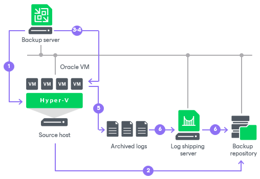

# How Oracle Archived Log Backup Works

In this article

The archived log backup for Oracle VMs is performed in the following way:

1. Veeam Backup & Replication launches the parent backup job by schedule.
2. The parent backup job creates an image-level backup of the Oracle VM and stores this backup in the backup repository.
3. A new session of the archived log backup starts. Veeam Backup & Replication accesses the VM guest OS to perform guest processing, collect database information and handle archived log.

If Oracle runs on a Microsoft Windows server, Veeam Backup & Replication accesses the VM guest OS over a guest interaction proxy. You can instruct Veeam Backup & Replication to select the guest interaction proxy automatically or assign it explicitly. For more information, see [Guest Interaction Proxies](guest_interaction_proxy.md).

By default, Veeam Backup & Replication accesses the VM guest OS over the network:

* For Linux VM guest OS — using SSH.

* For Microsoft Windows VM guest OS — using RPC.

If a network connection cannot be established, Veeam Backup & Replication accesses the VM guest OS over PowerShell Direct. PowerShell Direct is used for VMs that reside on Microsoft Hyper-V Server 2016 (or later) and run Microsoft Windows 10 (or later) or Microsoft Windows Server 2016 (or later). Veeam Backup & Replication requires Microsoft PowerShell 2.0 (or later) to work over PowerShell Direct.

1. Veeam Backup & Replication deploys the non-persistent runtime components or uses (if necessary, deploys) persistent agent components in the VM guest OS. The components scan the Oracle system and collect information about databases whose logs must be processed, including:

* List of all databases

* Database state — a database is on or off, in which logging mode it runs
* Paths to all database files (configuration logs and so on) and other data required for backup

Veeam Backup & Replication also detects whether it is possible to store logs in the backup repository through direct access or whether a log shipping server is required.

The non-persistent runtime components or persistent agent components copy archived log files from the log archive destination (set by the Oracle administrator) to a temporary folder on the VM guest file system.

1. Veeam Backup & Replication maps information about the Oracle system collected at step 4 with information kept in the configuration database. This periodic mapping helps reveal databases for which Veeam Backup & Replication must ship archived logs to the backup repository during this time interval.
2. Veeam Backup & Replication transfers archived log backup files from the temporary location on the Oracle VM to the backup repository and saves them as VLB files. Veeam Backup & Replication transfers logs either directly or through the log shipping server. The source-side Veeam Data Mover compresses log data to be transferred according to its built-in settings. On the backup repository side, data is compressed according to the parent backup job settings.

Archived logs that, for some reason, were not processed during the log backup interval remain in the temporary folder and are processed during the next log backup interval. To detect these remaining logs, Veeam Backup & Replication enumerates log files in the temporary folder.

|  |
| --- |
| Note |
| If a new session of the archived log backup starts and the parent backup job has not created a new restore point yet, the archived log backup job will remain in the idle state, waiting for a new restore point to be created. |

|  |
| --- |
| Important |
| Before backup, Veeam Backup & Replication shuts down databases in the NOARCHIVELOG mode. For details, see the [Backing Up a Database in NOARCHIVELOG Mode](https://docs.oracle.com/cd/B28359_01/backup.111/b28270/rcmbckba.htm#BRADV89526) section in the Oracle Database Backup and Recovery User Guide. |

Page updated 2/11/2025

Page content applies to build 13.0.1.1071
