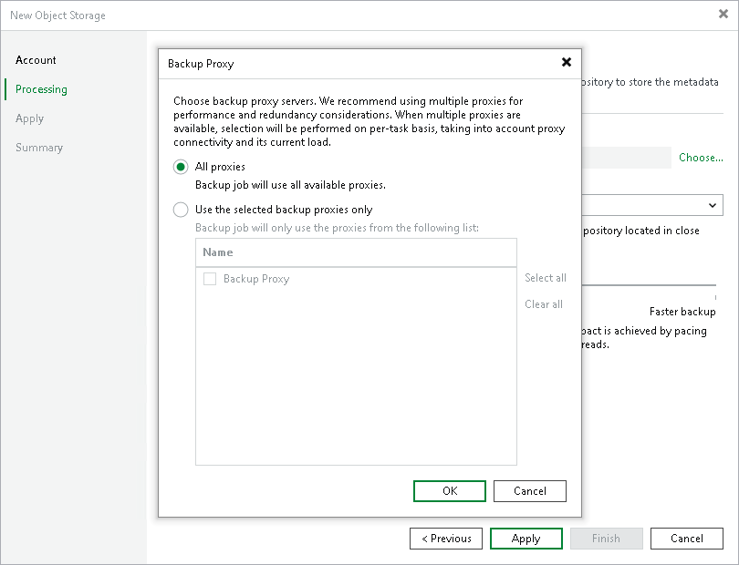
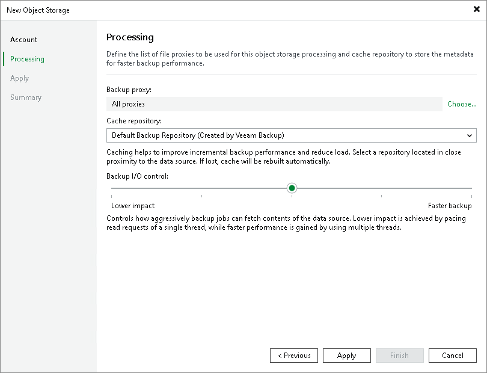

# Step 3. Specify Object Storage Processing Settings

In this article

At the Processing step of the wizard, do the following:

1. Click Choose next to the Backup proxy field to select a backup proxy.
2. In the Backup Proxy window, select proxy servers:

* If you select All proxies, Veeam Backup & Replication will use all available backup proxies for the object storage backup. The number of proxies in use defines the number of data threads that transfer data from the object storage to the backup repository. The more data transfer threads Veeam Backup & Replication uses, the higher is the data transfer speed.

If the object storage is used as a source for an object to tape backup job, the tape server utilized for this job is added as yet another backup proxy when creating an object to tape backup job. This backup proxy has the highest priority over all others and is used by default if it has access rights to the object storage. For details on object to tape backup jobs, see [Object Storage Backup to Tape](https://helpcenter.veeam.com/docs/backup/vsphere/object_to_tape_jobs.html?ver=120).

* If you select Use the selected backup proxies only, you can explicitly specify backup proxies that Veeam Backup & Replication must use for the object storage backup.

It is recommended that you select at least two backup proxies to ensure that the backup jobs start even if one of the proxies fails or loses its connectivity to the source object storage. The more proxies you select, the more data transfer threads Veeam Backup & Replication will use for backup jobs, thus improving performance.

Even if the object storage is used as a source for object to tape backup jobs, Veeam Backup & Replication will use only proxies selected in the list to process the backup data traffic.

1. From the Cache repository drop-down list, select a cache repository where temporary cache files must be stored. This repository must be located in the close proximity to the source object storage and backup proxies.

If you change the cache repository for an existing object storage whose backups are stored in another object storage, Veeam Backup & Replication will prompt you to either attach migrated metadata, copy metadata from the previous cache repository, or download metadata manually from the archive repository. For more information, see the [Unstructured Data Backups in Object Storage Repositories](https://helpcenter.veeam.com/docs/backup/vsphere/unstructured_data_backup_in_object_storage.html?ver=120) section.

1. Use the Backup I/O control slider to define how fast backup proxies can read data from the source object storage. This setting is based on the number of parallel threads that can be used by proxies configured for processing the object storage.

| I/O Control | Number of Proxies | Threads per Task |
| --- | --- | --- |
| Lower Impact | 1 | 1 |
| Below Normal | 1 | 4 |
| Normal | 2 | 8 |
| Above Normal | 4 | 16 |
| Faster Backup | Unlimited | 16 |

If resources of your object storage source are limited, it is recommended that you select the Lower impact option. If your object storage source is powerful enough, select the Faster backup option.

1. Click Apply to save the configured settings.

Page updated 11/7/2023

Page content applies to build 13.0.1.1071
