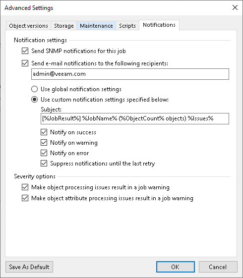

# Notification Settings

In this article

To specify notification settings for the the object storage backup job:

1. At the Backup Repository step of the wizard, click Advanced.
2. Click the Notifications tab.
3. Select the Send SNMP notifications for this job check box if you want to receive SNMP traps when the job completes successfully.

SNMP traps will be sent if you specify global SNMP settings in Veeam Backup & Replication and configure software on recipient's machine to receive SNMP traps. For more information, see the [Specifying SNMP Settings](snmp_settings.md) section.

1. Select the Send email notifications to the following recipients check box if you want to receive notifications about the job completion status by email. In the field under the check box, specify the recipient email address. You can enter several addresses separated by a semicolon.

Email notifications will be sent if you configure global email notification settings in Veeam Backup & Replication. For more information, see the [Configuring Global Email Notification Settings](general_email_notifications.md) section.

1. You can choose to use global notification settings or specify custom notification settings:

* To receive a typical notification for the job, select Use global notification settings. In this case, Veeam Backup & Replication will apply to the job global email notification settings specified for the backup server. For more information, see the [Configuring Global Email Notification Settings](general_email_notifications.md) section.

* To configure a custom notification for the job, select Use custom notification settings specified below. You can specify the following notification settings:

1. In the Subject field, specify a notification subject. You can use the following variables in the subject: %Time% (completion time), %JobName%, %JobResult%, %ObjectCount% (number of objects in the job) and %Issues% (number of objects in the job that have finished with the Warning or Failed status).
2. Select the Notify on success, Notify on warning, and Notify on error check boxes to receive email notification if the job completes successfully, completes with a warning or fails.
3. Select the Suppress notifications until the last retry check box to receive a notification about the final job status. If you do not enable this option, Veeam Backup & Replication will send one notification per every job retry.

1. Specify severity options if required:

* Select the Make object processing issues result in a job warning to receive a warning at the end of the job processing session if any issues with object processing occur.
* Select the Make object attribute processing issues result in a job warning to receive a warning at the end of the job processing session if any issues with processing of object attributes occur.

1. If you want to save this set of settings as the default one, click Save as default. When you create a new job, the saved settings will be offered as the default. This also applies to all users added to the backup server.

Page updated 6/3/2024

Page content applies to build 13.0.1.1071
