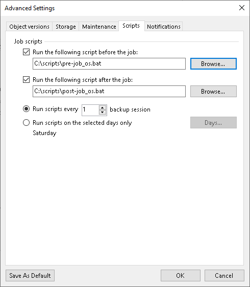

# Script Settings

In this article

You can configure custom scripts to run before or after the object storage backup job.

To specify script settings for the the object storage backup job:

1. At the Backup Repository step of the wizard, click Advanced.
2. Click the Scripts tab.
3. If you want to execute custom scripts, select the Run the following script before the job and Run the following script after the job check boxes and click Browse to choose executable files from a local folder on the backup server. The scripts are executed on the backup server.

You can select to execute pre- and post-backup actions after a number of backup sessions or on specific week days.

* If you select the Run scripts every <N> backup session option, specify the number of the backup job sessions after which the scripts must be executed.
* If you select the Run scripts on the selected days only option, click Days and specify week days on which the scripts must be executed.

1. If you want to save this set of settings as the default one, click Save as default. When you create a new job, the saved settings will be offered as the default. This also applies to all users added to the backup server.

Page updated 11/27/2023

Page content applies to build 13.0.1.1071
