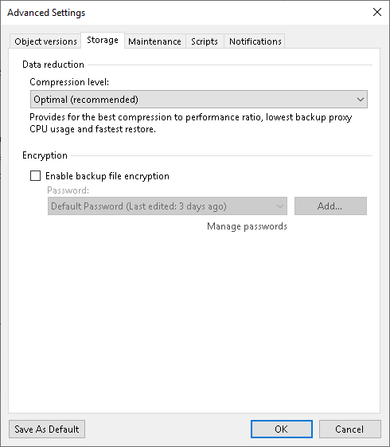

# Storage Settings

To specify advanced storage settings for the object storage backup job:

1. At the Backup Repository step of the wizard, click Advanced.
2. On the Storage tab, specify data reduction and encryption settings:

* From the Compression level list, select a compression level for the backup: None, Dedupe-friendly, Optimal, High or Extreme.

* To encrypt backup files, select the Enable backup file encryption check box. In the Password field, select the encryption method you want to use — a password that will generate secret keys or an external KMS server that will generate KMS keys. For more information about data encryption, see [How Backup Data Encryption Works](encryption_hiw.md).

If you have not created the password beforehand, click Add or use the Manage passwords link to specify a new password. For more information, see [Password Manager](password_manager.md).

If you do not use password loss protection, Veeam Backup & Replication will display a warning about it. For more information, see [Password Loss Protection](encryption_password_loss_protection.md).

|  |
| --- |
| Note |
| Consider the following:   * If you enable encryption for an existing backup job, during the next job session Veeam Backup & Replication will back up all the files of the file share to a new backup file irrespective of whether they changed or not. The created backup files and subsequent backup files will be encrypted with the specified password. * If you enable encryption for an existing job, Veeam Backup & Replication does not encrypt the previous backup chain created by this job.  * You can also use KMS keys for encryption. For more information, see [Key Management System Keys](kms.md). |

1. If you want to save this set of settings as the default one, click Save as default. When you create a new job, the saved settings will be offered as the default. This also applies to all users added to the backup server.

