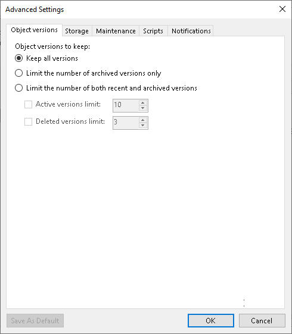

# Object Version Settings

In this article

To configure how many versions to keep for protected objects, do the following:

1. At the Backup Repository step of the wizard, click Advanced.
2. On the Object versions tab, specify to what object versions the settings should apply:

* Select Keep all versions to keep all object versions for the time period specified at the [Backup Repository](os_backup_job_target_repository.md) step.
* Select Limit the number of archived versions only to limit archived versions to the numbers specified to the right of the Active versions limit and Deleted versions limit check boxes.
* Select Limit the number of both recent and archived versions to limit recent and archived versions to the numbers specified to the right of the Active versions limit and Deleted versions limit check boxes.

1. After you choose what object versions to keep, specify how many file versions to keep:

* Select Active versions limit to keep the specified number of versions for objects currently existing in the object storage source. Specify how many object versions to store.
* Select Deleted versions limit to keep the specified number of versions for objects deleted from the object storage source. Specify how many object versions to store.

1. If you want to save this set of settings as the default one, click Save as default. When you create a new job, the saved settings will be offered as the default. This also applies to all users added to the backup server.

Page updated 6/3/2024

Page content applies to build 13.0.1.1071
