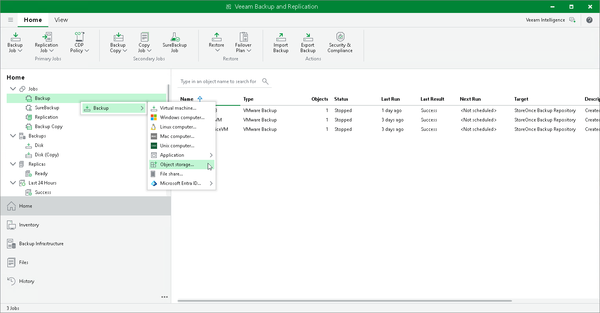

# Step 1. Launch New Object Storage Backup Job Wizard

In this article

To launch the New Object Storage Backup Job wizard, do one of the following:

* On the Home tab, click Backup Job > Object Storage.
* Open the Home view. Right-click in the working area, and select Backup > Object storage.
* Open the Home view. In the inventory pane, right-click the Jobs node and select Backup > Object storage.

You can quickly add an object storage source to an already existing job. Open the Inventory view. Under the Unstructured Data node in the inventory pane, select Object Storage. In the working area, right-click the object storage source you want to back up and select Add to backup job > name of the job.

Page updated 9/3/2025

Page content applies to build 13.0.1.1071
