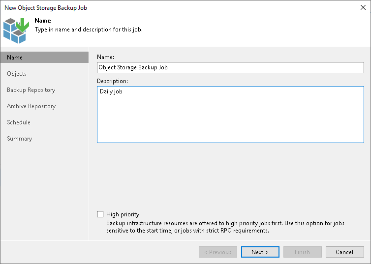

# Step 2. Specify Job Name and Description

At the Name step of the wizard, specify a name and description for the object storage backup job.

1. In the Name field, enter a name for the object storage backup job.
2. In the Description field, provide a description for future reference. The default description contains information about the user who created the job, date and time when the job was created.
3. Select the High priority check box if you want the resource scheduler of Veeam Backup & Replication to prioritize this job higher than other similar jobs and to allocate resources to it in the first place. For more information on job priorities, see [Job Priorities](job_priorities.md).

|  |
| --- |
| Tip |
| In the list of jobs in the Veeam Backup & Replication console, jobs with the High priority option enabled are marked with double green arrows (). |

