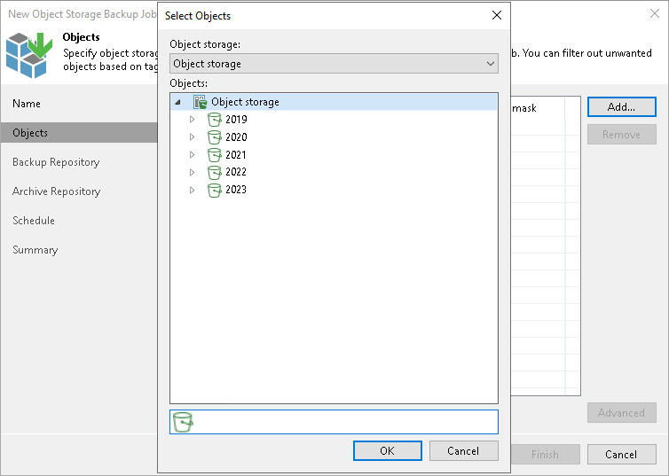

# Step 3. Select Objects to Back Up

In this article

At the Objects step of the wizard, select objects that you want to back up..

1. Click Add.
2. From the Object Storage drop-down list, select an object storage on which the necessary objects reside.

This drop-down lists contains all object storage added to the inventory, as described in the [Adding Object Storage](adding_object_storage.md) section.

1. In the Objects tree, select objects you want to back up.

To select multiple objects, hold [Ctrl] and click necessary folders.

1. If you specify a path to a bucket or container or prefix, all the contents will be processed.

If necessary, you can choose only specific objects from the added prefix.

Including Objects

To filter objects that you want to back up, you can specify the object name and extension masks.

1. Select an object in the Objects list and click Filters.
2. In the Include and exclude masks window, use Include masks field to include objects or prefixes.
3. Click Add.
4. In the Include object by tag window, specify the tag name and value associated with the object or prefix.
5. Click OK.

Excluding Objects

To filter objects that you do not want to back up, you can specify the objects by a path or by a tag.

1. Select an object in the Objects list and click Advanced.
2. In the Include and exclude masks window, use the Exclude masks field to exclude objects.
3. Click Add.
4. Depending on the way you want to exclude objects, select one of the following:

* To exclude objects by path, click Objects by path... and in the Exclude objects by path window, specify a path to the objects that you want to exclude.

|  |
| --- |
| Note |
| Wildcards are not supported. |

* To exclude objects by tag, click Objects by tag... and in the Exclude objects by tag window specify the tag name and value associated with the object or prefix.

|  |
| --- |
| Tip |
| You can follow this examples for specifying the path in the Exclude Object by path window:   * bucketname excludes the entire bucketname bucket. * bucketname/myprefix/ excludes all objects in bucketname which names start with myprefix. |

Exporting and Importing Filters

If necessary, you can export and import your masks:

* To export a mask to a file, click the Export these filters link. In the Export to file window, specify a path to the necessary XML file. Click OK.
* To import existing masks from a file, click the Import existing list link. In the Import masks from file window, specify a path to the necessary XML file. Click OK.

Page updated 4/11/2024

Page content applies to build 13.0.1.1071
