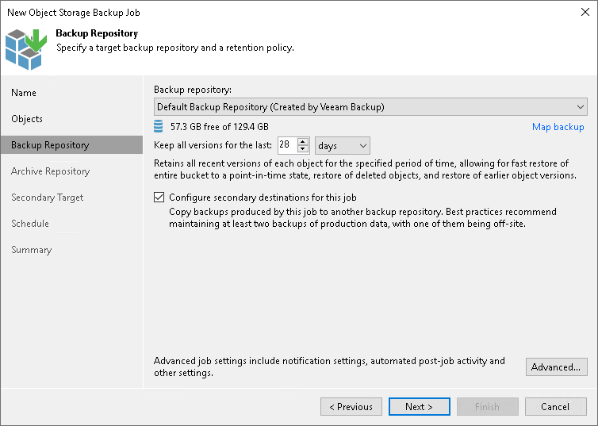

# Step 4. Specify Backup Repository Settings

In this article

At the Backup Repository step of the wizard, define the primary backup repository, where the object storage backup job must store objects, and settings for moving objects to this repository. To learn what storage types you can assign the role of the backup repository to, see [Storage Repositories](unstructured_data_backup_infrastructure.md#backup_repository) in the Backup Infrastructure for Unstructured Data Backup section.

|  |
| --- |
| Note |
| Consider that if you use the option of limiting the number of object versions to keep configured in [Object Version Settings](os_backup_job_advanced_version.md), Veeam Backup & Replication first applies those object-version retention settings and only after that applies time-based retention settings specified at this step. |

1. From the Backup repository drop-down list, select a repository where backup files must be stored. When you select a backup repository, Veeam Backup & Replication automatically checks the amount of free space left. Make sure that you have enough free space to store backups.
2. You can map the job to a specific backup stored in the backup repository. Backup job mapping allows you to move backup files to a new backup repository and to point the job to existing backups on this new backup repository. You can also use backup job mapping if the configuration database got corrupted and you need to reconfigure backup job settings.

To map the job to a backup, click the Map backup link. In the opened Select Backup window, select a backup in the backup repository. Backups can be easily identified by job names. To find the backup, you can also use the search field at the bottom of the window.

1. Use the Keep all versions for the last field to specify how long copies of all recent object versions from the selected object storage bucket or container must be kept in the backup repository. You can restore the entire bucket or container to any restore point within the period specified in this setting.

If, for example, Keep all versions for the last is set to 30 days, the backup repository will store all object versions that appeared in the object storage bucket or container during the last 30 days. At the scheduled time on the 31st day, the object storage backup job first backs up new object versions and saves them to the backup repository. Right after that, object versions older than 30 days (created on the 1st day) are either deleted from the backup repository or moved to the archive repository. Object versions are moved to the archive repository, if at the [Archive Repository](os_backup_job_archive_repository.md) step of the wizard you enable the Archive file versions to the following archive repository check box and configure the archive retention.

1. If you need to keep a copy of backups in another repository, select the Configure secondary destinations for this job check box. That enables the [Secondary Target](file_share_backup_job_secondary_target.md) step of the wizard.

Page updated 6/3/2024

Page content applies to build 13.0.1.1071
