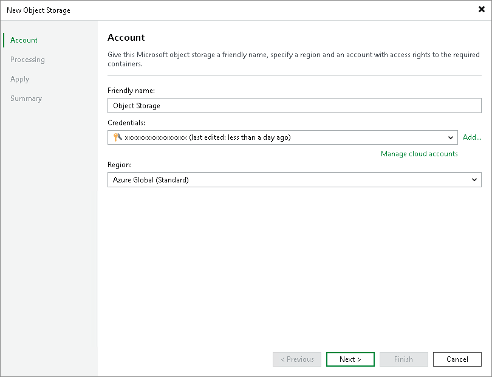

# Step 2. Specify Account Settings

At the Account step of the wizard, specify a friendly name and connection settings of your object storage:

1. In the Friendly name field, specify a name you want to assign to your object storage. This name will be displayed in the list of your object storage repositories in the inventory of the virtual infrastructure.
2. From the Credentials drop-down list, select user credentials to access your Microsoft Azure Blob storage.

If you already have a credentials record that was configured in advance, select such a record from the drop-down list. Otherwise, click Add and provide your access and secret keys, as described in the [Cloud Credentials Manager](https://helpcenter.veeam.com/docs/vbr/userguide/cloud_credentials.html?ver=13) section. You can also click the Manage cloud accounts link to add, edit or remove a credentials record.

1. From the Region drop-down list, select an Azure region.

