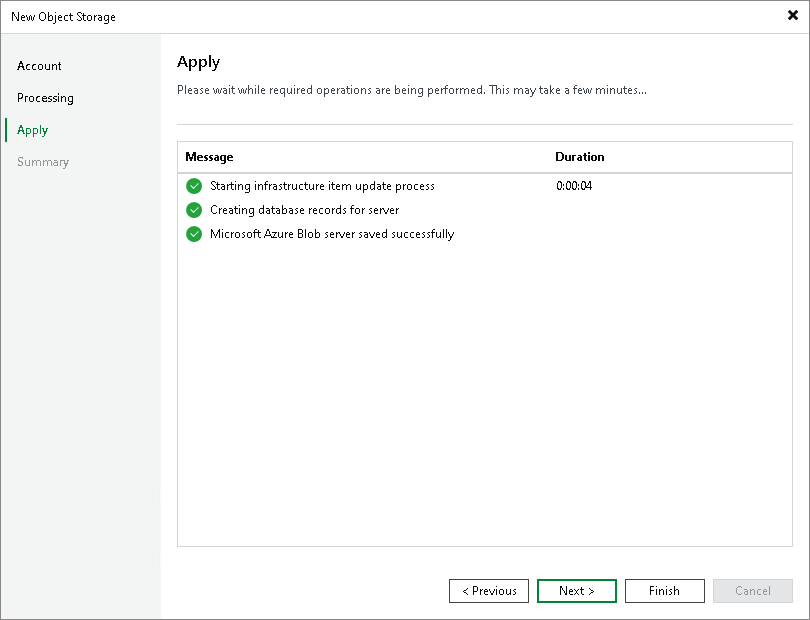

# Step 4. Apply Object Storage Settings

At the Apply step of the wizard, wait till Veeam Backup & Replication installs and configures all required components and adds the object storage to the inventory of the virtual infrastructure. Click Next to proceed.

Page updated 2026-07-24

