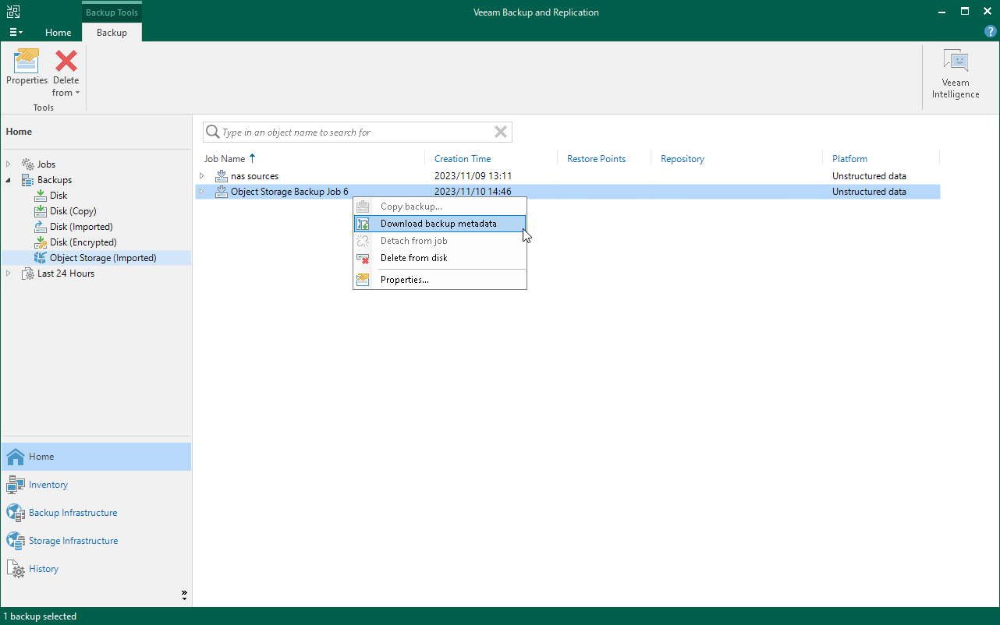
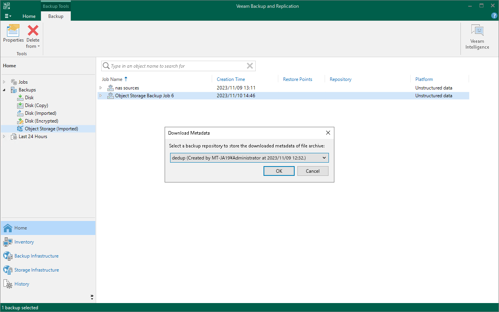

# Restoring Objects from Archive Repository

You can restore any object from the archive repository to the state of any object version stored in the archive. Depending on the circumstances, such a restore can require different actions.

|  |
| --- |
| Note |
| Consider that from the archive repository you can restore objects only. Restore of whole prefixes from the long-term repository is not supported. |

Regular Restore from Archive

To perform a regular restore from the archive repository when you have all required backup data stored both in the backup repository and archive repository, follow the instructions given in the [Restoring Individual Objects or Versions](os_data_recovery_restore_individual_objects.md) section. Consider that to restore data from the archive repository, you must select the All Time option for [selecting objects to restore](restore_individual_objects_browser.md).

Emergency Restore from Archive

There can be different situations where backups are not available in the backup repository: for example, backed-up objects are corrupted or deleted from the backup repository, backup configuration files are removed from the configuration, archive repository is added into backup infrastructure of another backup server, or backup archive is moved from one archive repository to another one. In these cases, you can restore specific objects from the backup archive.

To restore objects from the archive repository, for example, from an object storage:

1. If necessary, add the storage that keeps the required archive to the backup infrastructure as described in section [Adding Backup Repositories](repo_add.md).
2. Rescan the added archive repository as described in section [Rescanning Backup Repositories](rescanning_backup_repositories.md).
3. Download metadata for the archive backup:

1. Locate the required object backup archive under Backups > Object Storage (Imported) node in the Home view.
2. Right-click the object backup and select Download backup metadata.

1. From the drop-down list, select a backup repository to store the downloaded metadata of objects archive and click OK.

1. Restore objects from the archive backup as described in the [Restoring Individual Objects or Versions](os_data_recovery_restore_individual_objects.md) section.

