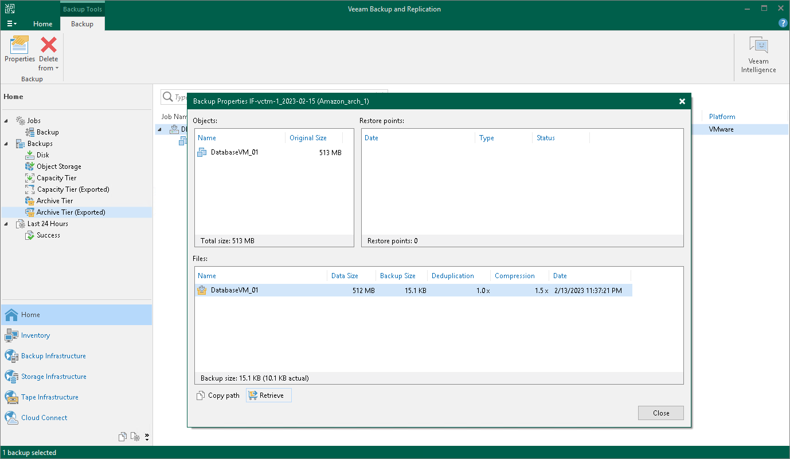

# Step 1. Launch Retrieve Backup Wizard

To launch the retrieval job, do one of the following:

* Open the Home view. In the [inventory pane](vbr_ui.md) select Object Storage. In the working area, select the backup job whose files you want to retrieve and click Properties on the ribbon. In the Backup Properties window, click on Retrieve.

* Open the Home view. In the [inventory pane](vbr_ui.md) select Object Storage. In the working area, select the object you want to restore and on the ribbon select the necessary type of restore. At the [Select Restore Point](restore_individual_objects_restore_point.md) step of the restore wizard, if the selected restore point has not been retrieved yet, you will be prompted to launch the Retrieve Backup wizard.

Page updated 2026-07-28

