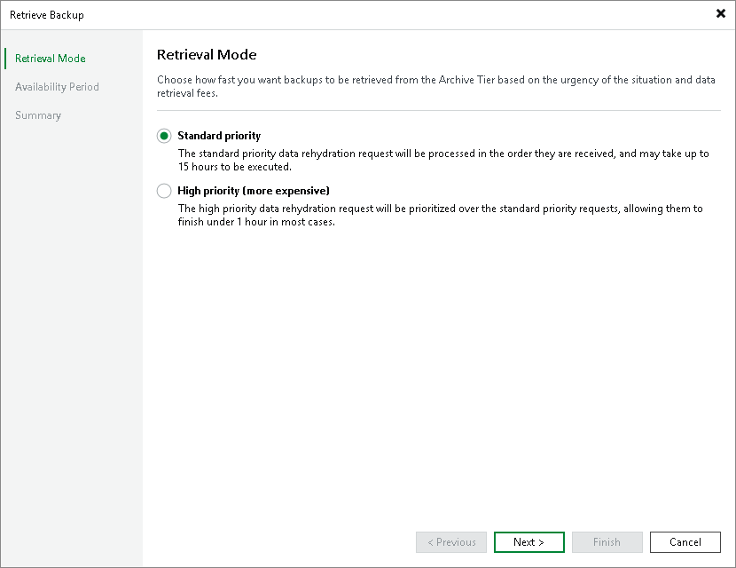

# Step 2. Specify Retrieval Mode

At the Retrieval Mode step of the wizard, select the desired retrieval option. For information on the retrieval modes for different archive storage options, see [Data Retrieval](archive_tier_retrieval.md).

Page updated 2026-07-28

