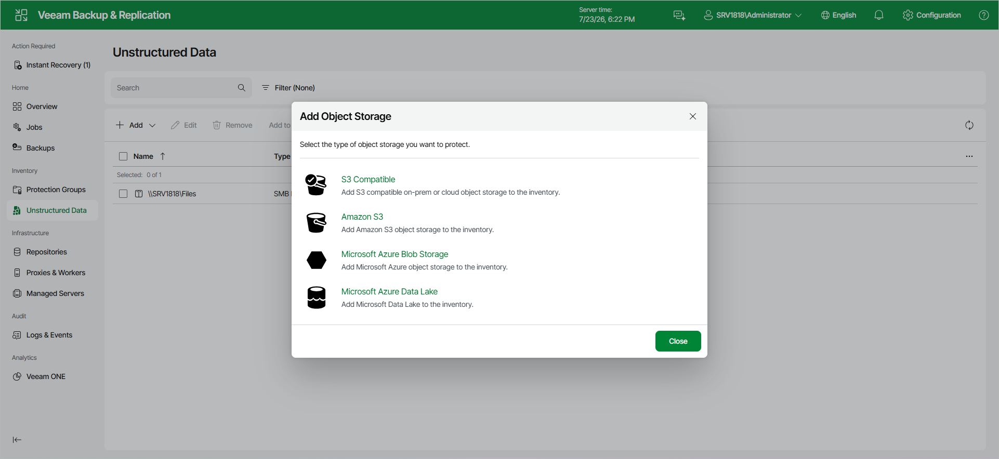

# Step 1. Launch New Object Storage Wizard

To launch the New Object Storage wizard:

1. Open the Unstructured Data node in the management pane.
2. Click Add.
3. From the drop-down list, select Object Storage.
4. In the Add Object Storage window, select Amazon S3.

Page updated 2026-07-27

