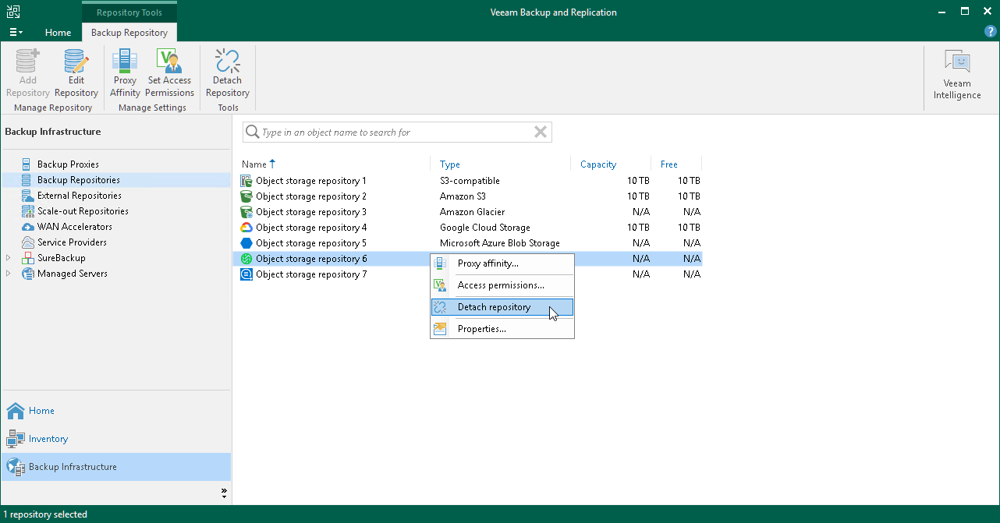

# Detaching Object Storage Repository

You can detach an object storage repository after you have [imported its backups](osr_import_backups.md) and finished working with this repository. After you detach the object storage repository, the [imported](osr_import_backups.md) backups become unavailable.

To detach an object storage repository, do the following:

1. Open the Backup Infrastructure view.
2. In the navigation pane, select the Backup Repositories node.
3. In the preview pane, select object storage the backups of which have been imported and click Detach Repository on the toolbar or right-click object storage and select Detach Repository.

Related Topics

[Importing Object Storage Backups](osr_import_backups.md)

