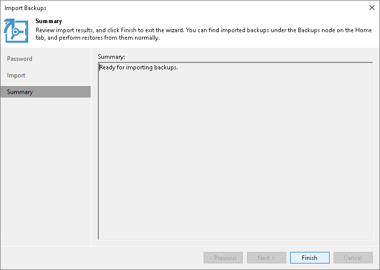

# Step 4. Finish Working with Wizard

In this article

At the Summary step of the wizard:

1. Review details of the import operation.
2. Click Finish to run a Configuration Database Resynchronize session.

During this session, all existing backups will be imported into the Veeam Backup & Replication console.

Page updated 5/27/2024

Page content applies to build 13.0.1.1071
