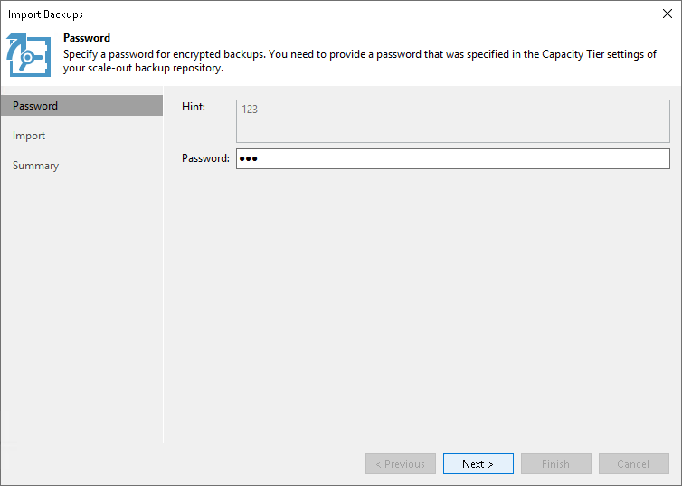

# Step 2. Specify Password

In this article

This step is only available when importing encrypted backups.

At the Password step of the wizard, in the Password field, specify the password that was used to encrypt data during offload or copy sessions.

Related Topics

* [Moving Backups to Capacity Tier](capacity_tier_move.md)
* [Copying Backups to Capacity Tier](capacity_tier_copy.md)
* [Add Capacity Tier](new_capacity_tier.md)

Page updated 7/23/2024

Page content applies to build 13.0.1.1071
