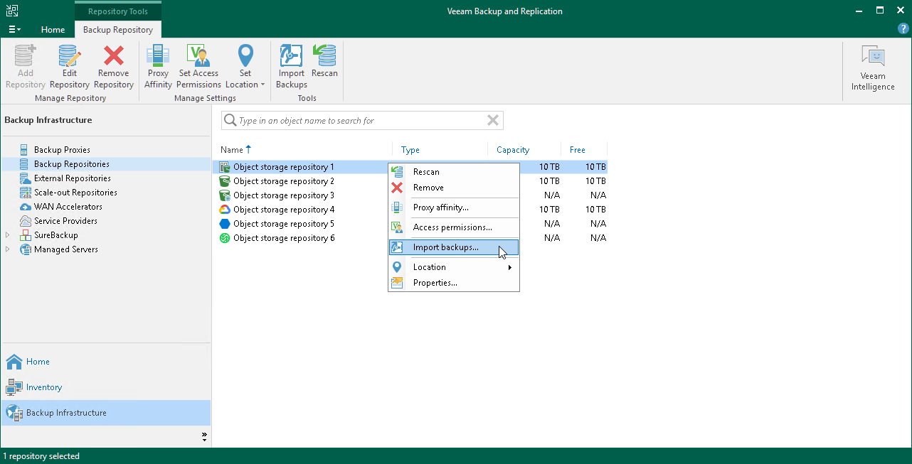

# Step 1. Launch Import Wizard

To launch the Import Backups wizard, open the Backup Infrastructure view and in the inventory pane select the Backup Repositories node. In the preview pane, select necessary object storage and select Import Backups. Alternatively, right-click necessary object storage and select Import backups.

