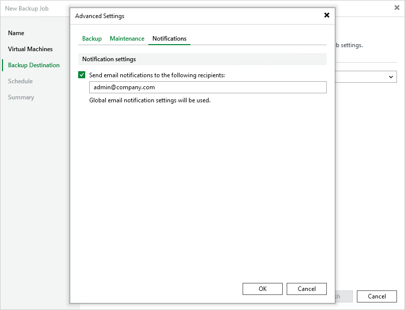

# Configuring Advanced Settings

In the Advanced settings window, you can schedule full backups, configure health check settings, specify backup file storage settings and enable email notifications.

Backup Settings

To instruct Veeam Backup & Replication to create full backups according to a specific schedule, switch to the Backup tab and do the following:

* To schedule synthetic full backups, select the Create synthetic full backups periodically check box, click Configure and choose whether you want to create these backups on specific days on a weekly or monthly basis.
* To schedule active full backups, select the Create active full backups periodically check box, click Configure and choose whether you want to create these backups on specific days on a weekly or monthly basis.

Alternatively, you can create active full backups manually when needed. For more information, see [Creating Active Full Backups](ovirt_crearting_active_full_backup.md).

|  |
| --- |
| Important |
| * Synthetic full backups cannot be scheduled if an object storage repository is selected as the target location for backups. * Schedule synthetic full backups to run on days when the backup job is scheduled. Otherwise, no synthetic full backup will be created. * Do not schedule synthetic and active full backups to run at the same time. Due to technical limitations, Veeam Plug-in for oVirt KVM will be unable to create synthetic full backups according to the specified schedule. |

Health Check Settings

To instruct Veeam Backup & Replication to periodically perform a health check for backups, switch to the Maintenance tab, select the Perform backup files health check (detects and auto-heals corruption) on check box, then click Configure and specify a schedule for the health check to run.

|  |
| --- |
| Important |
| * It is recommended that the backup and health check schedules configured for the job do not overlap to avoid data access issues. * If you have selected an off-premise cloud object storage repository as the target location for backups at [step 4](ovirt_backup_job_destination.md), it is recommended that a [helper appliance is configured in the repository settings](https://helpcenter.veeam.com/docs/backup/vsphere/compatible_mount_server.html?ver=120). Otherwise, additional data transfer costs may occur. |

To configure retention settings for backups of VMs that are no longer processed by the backup job, select the Remove deleted items data after check box, and specify the number of days during which Veeam Plug-in for oVirt KVM will keep backups of VMs excluded from the job.

Notification Settings

To instruct Veeam Backup & Replication to send email notifications on the backup job results, switch to the Notifications tab, select the Enable email notifications check box and specify an email address of a recipient; use a semicolon to separate multiple recipient addresses. For Veeam Backup & Replication to be able to send email notifications, you must configure a mail server as described in [Configuring Email Settings](ovirt_email_settings.md).

|  |
| --- |
| Note |
| Email notifications on the backup job results will be also sent to recipients configured in the global notifications settings. |

