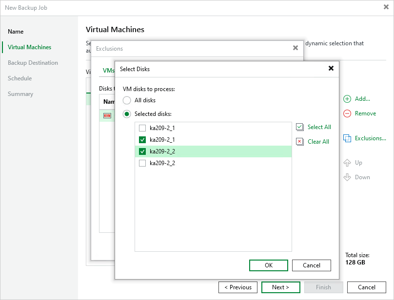

# Step 3. Configure Backup Source Settings

First, at the Virtual Machines step of the wizard, specify the backup scope — resources that Veeam Plug-in for oVirt KVM will back up:

1. Click Add.
2. In the Add Objects window, choose whether you want to back up specific VMs or groups of VMs arranged by tags:

* If you click the VM icon, you must specify the machines explicitly.

|  |
| --- |
| Note |
| If any of the selected VMs have disks in the RAW format attached, Veeam Plug-in for oVirt KVM will display the following warning: "There are some VM disks that do not support oVirt incremental backup. The policy will do a full scan backup for those disks". Due to technical limitations, Veeam Plug-in for oVirt KVM is only able to apply the [CBT mechanism](ovirt_changed_block_tracking.md) to disks in the QCOW2 format while performing incremental backup.  You can proceed with the wizard and resolve the issue later by using one of the workarounds described in this [Veeam KB article](https://www.veeam.com/kb4345). |

* If you click the Tag icon and add a tag to the backup scope, Veeam Plug-in for oVirt KVM will regularly check for new VMs assigned the added tag and automatically update the backup job settings to include these VMs in the scope. For a tag to be displayed in the list, it must be created in the Administration Portal and assigned to a VM. For more information on tags, see [oVirt Product Documentation](https://www.ovirt.org/documentation/administration_guide/index.html#chap-Tags).

By default, backup jobs process all VMs to which the added tags are assigned. If you want to exclude specific VMs from the backup scope, click Exclusions and specify the VMs that you do not want to back up — the procedure is the same as described for including VMs in the backup scope.

While running the job, Veeam Plug-in for oVirt KVM processes resources in the order they are added to the backup scope. However, you can change the order, for example, if you add some mission-critical VMs to the job and want them to be processed first. To change the processing order, select a resource and use the Up or Down buttons.

|  |
| --- |
| Note |
| If you include a tag into the backup scope, VMs assigned this tag are processed at random. To ensure that the VMs are processed in a specific order, you must add them as standalone VMs. |

By default, jobs process all disks attached to VMs included into the backup scope. However, you can instruct Veeam Plug-in for oVirt KVM to back up only specific virtual disks related to the selected backup scope. To do that,

1. Click Exclusions.
2. In the Exclusions window, switch to the Disks tab and click Add.
3. In the Add Objects window, select a resource that you have added to the backup scope and click OK.
4. Back to the Exclusions window, select the resource and click Edit.
5. In the Select Disks window, select the Selected Disks option and click Add.
6. Select disks that you want to back up.

Disks that you do not select will be excluded from the backup job.

