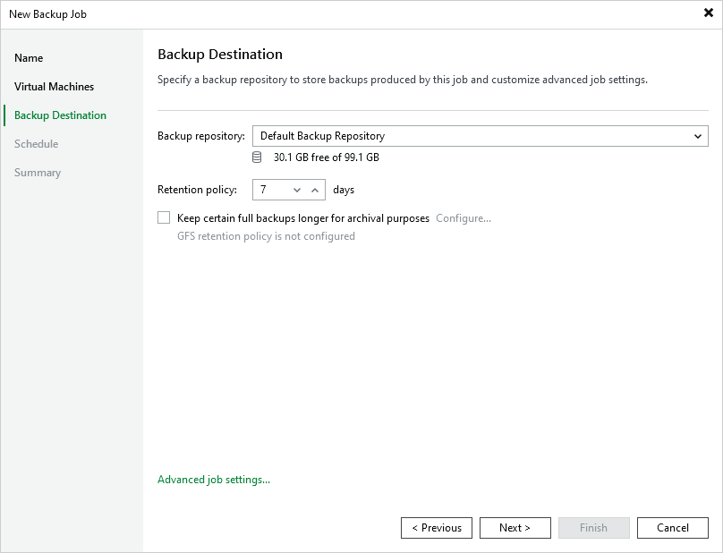

# Step 4. Specify Backup Job Settings

At the Backup Destination step of the wizard, do the following:

1. In the Backup repository drop-down list, select a backup repository where you want to store backups.

1. In the Retention policy section, choose how long Veeam Backup & Replication a will keep restore points in a backup chain. If a restore point is older than the specified limit, Veeam Backup & Replication will remove it from the chain. For more information, see [Retention Policies](ovirt_backup_retention.md).

If the UUID of a VM changes (for example, if the VM was migrated to another cluster), Veeam Plug-in for oVirt KVM will be unable to continue the backup chain for this VM. After you re-add the VM to the backup job, Veeam Plug-in for oVirt KVM will start a new backup chain for it. However, you will still be able to perform restore operations using backups from the old backup chain.

|  |
| --- |
| Important |
| If you use [hardened repositories](https://helpcenter.veeam.com/docs/backup/vsphere/hardened_repository.html?ver=120) to store oVirt KVM VM backups, you must consider the following requirements:   * Active full backups must be scheduled in the backup job settings. * The backup job retention period must be longer than the backup repository immutability period.   For example, if the backup repository immutability period is set to 25 days, you can configure a one-month retention period: specify 4 as the number of restore points, [schedule one backup per week](ovirt_backup_job_schedule.md) and schedule active full backup to run on the last day of the month. |

To help you implement a comprehensive backup strategy, Veeam Plug-in for oVirt KVM allows you to [enable long-term retention policy for backups](ovirt_backup_job_gfs.md) and to [configure backup job advanced settings](ovirt_backup_job_advanced.md) (such as backup maintenance, health check, active and synthetic full backups).

