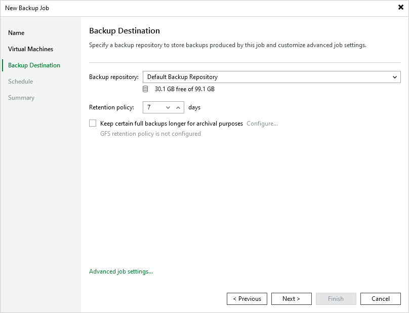

# Step 4. Specify Backup Job Settings

At the Backup Destination step of the wizard, do the following:

1. In the Backup repository drop-down list, select a backup repository where you want to store backups.

When restoring data of backed-up VMs, Veeam Backup & Replication will offer you to choose a restore point from the list of all restore points available in the default backup repository. To allow Veeam Backup & Replication to detect restore points created for these VMs by other backup jobs or stored in other backup repositories, you can map these restore points to this backup job — this way, Veeam Backup & Replication will be able to continue existing backup chains and will transfer less data over network, reducing unwanted overhead for the production environment. To do that, click Map backup and choose the necessary backup.

1. In the Retention policy section, choose how long Veeam Backup & Replication will keep restore points in a backup chain. If a restore point is older than the specified limit, Veeam Backup & Replication will remove it from the chain. For more information, see [Retention Policies](ovirt_backup_retention.md).

If the UUID of a VM changes (for example, if the VM was migrated to another cluster), Veeam Plug-in for oVirt KVM will be unable to continue the backup chain for this VM. After you re-add the VM to the backup job, Veeam Plug-in for oVirt KVM will start a new backup chain for it. However, you will still be able to perform restore operations using backups from the old backup chain.

|  |
| --- |
| Important |
| If you use [hardened repositories](hardened_repository.md) to store oVirt KVM VM backups, you must consider the following requirements:   * Active full backups must be scheduled in the backup job settings. * The backup job retention period must be longer than the backup repository immutability period.   For example, if the backup repository immutability period is set to 25 days, you can configure a one-month retention period: specify 4 as the number of restore points, [schedule one backup per week](ovirt_backup_job_schedule.md) and schedule active full backup to run on the last day of the month. |

To help you implement a comprehensive backup strategy, Veeam Plug-in for oVirt KVM allows you to [enable long-term retention policy for backups](ovirt_backup_job_gfs.md) and to [configure backup job advanced settings](ovirt_backup_job_advanced.md) (such as backup maintenance, health check, active and synthetic full backups).

Page updated 2026-07-24

