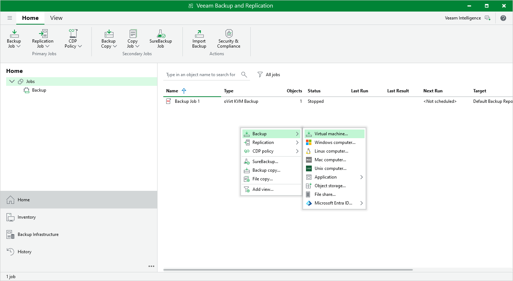

# Step 1. Launch New Backup Job Wizard

To launch the New Job wizard, do the following:

1. Open the Home view.
2. In the inventory pane, select Jobs.

1. On the ribbon, click Backup Job > Virtual Machine.

Alternatively, right-click the working area and select Backup > Virtual Machine.

