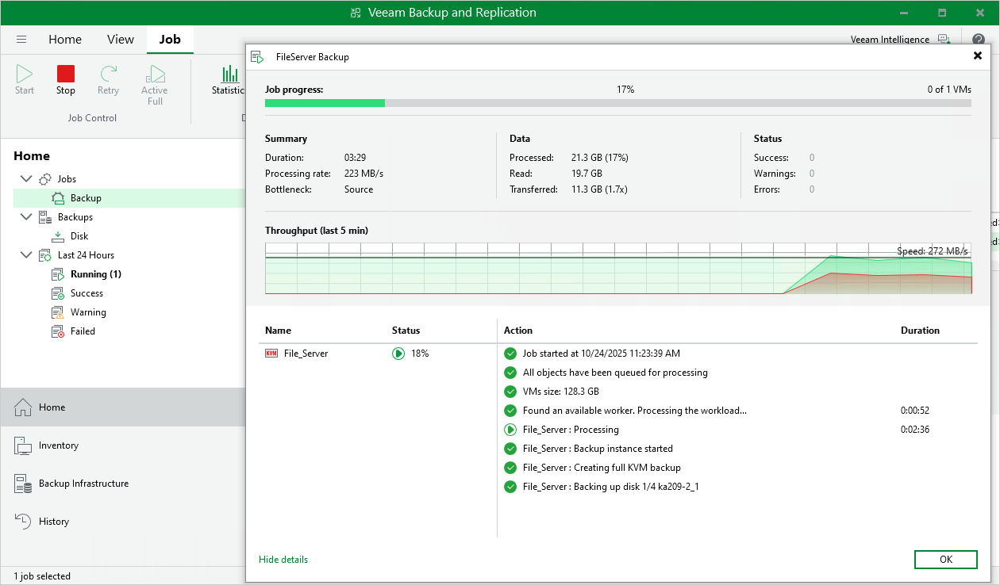

# Analyzing Performance Bottlenecks

As any backup application handles a great amount of data, it is important to make sure the data flow is efficient and all resources engaged in the backup process are optimally used. For backup jobs, Veeam provides advanced statistics about the data flow efficiency and lets you identify bottlenecks at the following stages of the data transmission process:

1. Reading VM data blocks from the source.
2. Processing VM data on a worker.
3. Transporting data over the network.
4. Writing data to the target.

While evaluating the data transmission process, Veeam Backup & Replication analyzes performance of all the data flow components:

* Source — the source disk reader component responsible for retrieving data from the source node.
* Proxy — the worker component responsible for processing VM data.
* Network — the network queue writer component responsible for getting processed VM data from the worker and sending it over the network to the Target (directly or through the Gateway Server).
* Target — the gateway server component responsible for processing VM data, or the target disk writer component responsible for storing data in the backup repository.

To see the bottleneck statistics for a job or a specific VM processed by the job, do the following:

1. In the Veeam Backup & Replication console, open the Home view.
2. In the inventory pane, select Jobs.
3. In the working area, right-click a backup job for which you want to see the bottleneck statistics, and select Statistics.
4. In the job session window, check the bottleneck statistics:

* To see the aggregated statistics for the whole job, check the Load field in the Action column.
* To see the bottleneck statistics for a specific VM, click a VM name and check the Load field in the Action column.

To learn how to analyze the bottleneck statistics, see [Performance Bottlenecks](detecting_bottlenecks.md).

