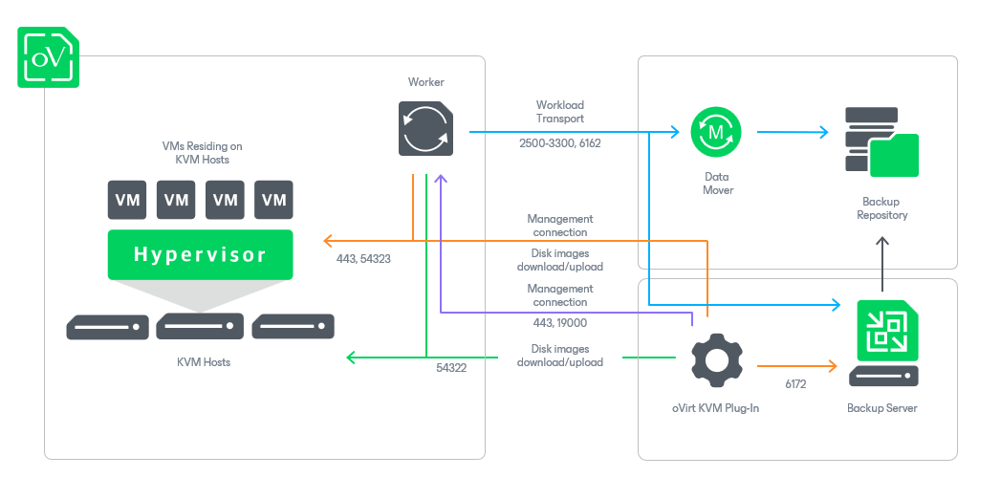

# Solution Architecture

Since Veeam Plug-in for oVirt KVM is integrated with Veeam Backup & Replication, the solution architecture comprises the following set of components:

* [oVirt KVM Manager](#cluster)
* [Backup server](#server)
* [oVirt KVM Plug-in](#plugin)
* [Backup repositories](#repositories)
* [Workers](#workers)

oVirt KVM Manager

The oVirt KVM Manager is a Linux-based physical or virtual machine that manages oVirt KVM resources such as VMs, hosts, clusters, storage domains and networks. Veeam Plug-in for oVirt KVM uses the oVirt KVM Manager to access oVirt KVM resources while performing backup and restore operations.

Backup Server

The backup server is a Windows-based physical or virtual machine on which Veeam Backup & Replication is installed. The backup server is the configuration, administration and management core of the backup infrastructure. It coordinates backup and restore operations, controls job scheduling and manages resource allocation.

Veeam Plug-In for oVirt KVM

Veeam Plug-in for oVirt KVM is an architecture component that enables integration between the backup server and other components of the backup infrastructure. Veeam Plug-in for oVirt KVM also allows the backup server to deploy and manage the workers.

Backup Repositories

A backup repository is a storage location where Veeam Plug-in for oVirt KVM stores backups of protected VMs.

To communicate with backup repositories, Veeam Plug-in for oVirt KVM uses Veeam Data Mover — the service that is responsible for data processing and transfer. By default, Veeam Data Mover runs on the repositories themselves. If a repository cannot host Veeam Data Mover, it starts on a gateway server — a dedicated component that “bridges” the backup server and workers. For more information, see [Gateway Servers](gateway_server.md).

Workers

A worker is an auxiliary Linux-based VM that resides in the cluster and processes backup workloads when transferring data to and from backup repositories.

