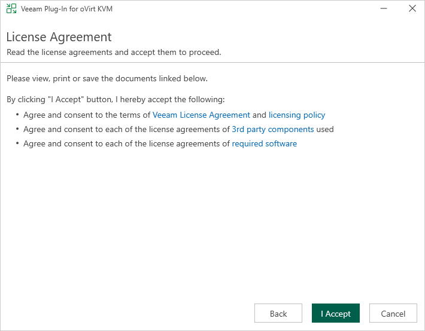
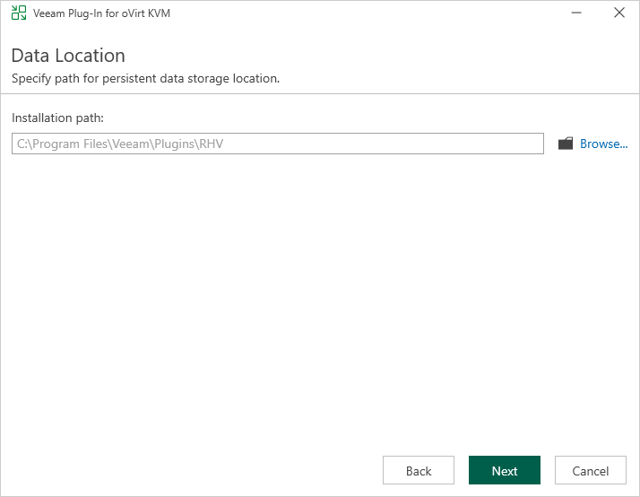

# Installing Veeam Plug-In for oVirt KVM

The plug-in that allows you to protect oVirt KVM resources comes pre-installed with the default installation package of Veeam Backup & Replication. However, you may require to install a new plug-in version on the backup server manually if some updates or patches become available.

|  |
| --- |
| Note |
| If you use a remote Veeam Backup & Replication console, you do not need to install Veeam Plug-in for Proxmox VE on the workstation where the remote Veeam Backup & Replication console is deployed. |

To install Veeam Plug-in for oVirt KVM, do the following:

1. Log in to the backup server using an account with the local Administrator permissions.
2. Download the product installation file KVMPlugin\_13.7.0.473.zip from the [Veeam downloads page](https://www.veeam.com/kvm-backup-recovery-download.html).
3. Open the downloaded archive file and launch the KVMPlugin\_13.7.0.473.exe installation file.

Before proceeding with installation, the installer will check whether you have Microsoft .NET Core Runtime installed on the backup server. In case the required version is missing, the installer will offer to install it automatically. To do that, click OK.

1. At the License Agreement step of the Veeam Plug-in for oVirt KVM Setup wizard, read and accept both the Veeam license agreement, licensing policy, the 3rd party components and required software license agreement. If you reject the agreements, you will not be able to continue installation.

To read the terms of a license agreement, click View.

1. At the Installation Path step of the wizard, you can change the installation directory if necessary.

1. Click Install to begin installation.

